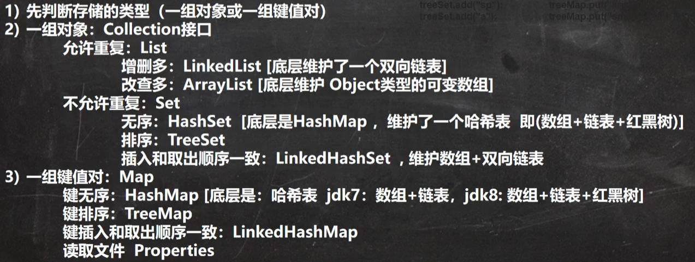

7.22记录

# Hashtable

**特点**

1. 存放的元素是k-v键值对
2. hashtable的键和值都不能为null
3. hashtable 使用方法与hashMap一致
4. hashtable不同于hashMap，其线程是安全的

底层

- 底层由数组 Hashtable$entry[] 初始化大小为11
- 扩容机制，达到临界值0.75，直接容量翻倍  

**hashtable与hashmap区别**

## 实现子类Properties

1. Properties类继承字Hashtable类并且实现了Map接口，也是使用一种键值对的形式来保存数据
2. 使用特点与Hashtable类似
3. Properties还可以用于xx.Properties文件中，加载数据到Properties类对象并进行读取和修改
4. xx.Properties文件通常作为配置文件

# 小结

在开发中选择那种集合实现类的思路：

# TreeSet

1.使用无参构造TreeSet，元素是无序的

2.TreeSet提供了有参构造器,可以<u>通过提供Comparator（）比较器并指定排序规则</u>

3.因为底层是TreeMap同样元素不能为空

注意：TreeSet的底层是TreeMap，所以两者排序的实现是类似的

# TreeMap

1.使用无参构造TreeMap，k-v元素是无序的

2.TreeMap提供了有参构造器,可以<u>通过提供Comparator（）比较器并指定排序规则</u>实现以键值排序 

3.TreeMap元素不能为空

