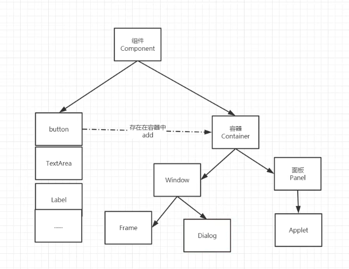
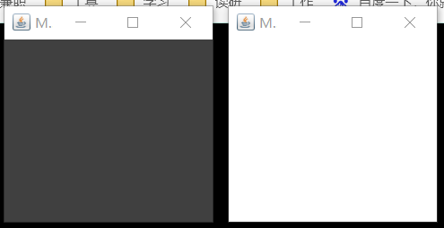
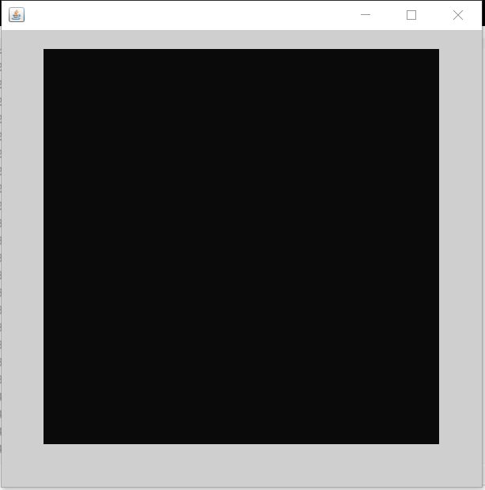

# GUI编程

组件

- 窗口
- 弹窗
- 面板
- 文本框
- 列表框
- 按钮
- 图片
- 监听事件
- 鼠标、键盘事件

## 1、简介

GUI核心：Swing、AWT

缺点：1.界面不美观 2.需要jre环境

重点：了解MVC架构，了解监听

## 2、AWT

### 2.1、AWT简介

1. 包含很多类和接口
2. 元素：窗口、按钮、文本框
3. java.awt



### 2.2、组件和容器

#### 1.Frame窗口

```java
// 第一个案例
package com.cxx.gui;

import java.awt.*;

public class TestFrame {
    public static void main(String[] args) {
        // Frame 源码
        Frame fra = new Frame("java图形界面窗口");
        // 需要设置可见性
        fra.setVisible(true);
        // 设置窗口大小、背景颜色
        fra.setSize(400, 400);
        fra.setBackground(new Color(100, 100, 100));
        fra.setLocation(200, 200);
        fra.setResizable(false);
    }
}
// 第二个案例
package com.cxx.gui;

import java.awt.*;

public class TestFrame1 {
    public static void main(String[] args) {
        MyFrame myFrame1 = new MyFrame(100, 100, 200, 200, Color.DARK_GRAY);
        MyFrame myFrame2 = new MyFrame(100, 100, 300, 300, Color.white);
    }
}

class MyFrame extends Frame{

    static int id = 0;

    public MyFrame(int x, int y,int w,int h,Color color)  {
        super("MyFrame+"+(++id));
        setBackground(color);
        setBounds(x,y,w,h);
        setVisible(true);
    }
}
```

效果图：



####  2.面板Panel

案例

```java
package com.cxx.gui;

import java.awt.*;
import java.awt.event.WindowAdapter;
import java.awt.event.WindowEvent;

public class TestPanel {
    public static void main(String[] args) {
        Frame frame =new Frame();
        Panel panel = new Panel();
        // 设置布局
        frame.setLayout(null);
        // 设置坐标
        frame.setBounds(300,300,500,500);
        frame.setBackground(new Color(207, 207, 208));
        // panel设置坐标，基于frame
        panel.setBounds(50,50,400,400);
        panel.setBackground(new Color(10,10,10));
        frame.add(panel);
        frame.setVisible(true);
        // 设置监听事件，关闭窗口
        // 适配器模式
        frame.addWindowListener(new WindowAdapter() {
            @Override
            public void windowClosing(WindowEvent e) {
                // super.windowClosing(e);
                System.exit(0);
            }
        });
    }
}
```

效果图



### 3.布局管理器

- 流式布局

  ```java
  package com.cxx.gui;
  
  import java.awt.*;
  
  public class TestFlowLayout {
      public static void main(String[] args) {
          Frame frame = new Frame();
          // 组件-按钮
          Button button1 = new Button();
          Button button2 = new Button();
          Button button3 = new Button();
          // 设置流式布局(默认居中)
          frame.setLayout(new FlowLayout());
          // 设置靠左
          // frame.setLayout(new FlowLayout(FlowLayout.LEFT));
          frame.setSize(200,200);
          frame.add(button1);
          frame.add(button2);
          frame.add(button3);
      }
  }
  
  ```

- 东西南北中布局

  ```java
  package com.cxx.gui;
  
  import java.awt.*;
  
  public class TestBorderLayout {
      public static void main(String[] args) {
          Frame frame = new Frame("TestBorderLayout");
          Button east = new Button("East");
          Button wast = new Button("Wast");
          Button south = new Button("South");
          Button north = new Button("North");
          Button center = new Button("Center");
  
          frame.add(east,BorderLayout.EAST);
          frame.add(wast,BorderLayout.WEST);
          frame.add(south,BorderLayout.SOUTH);
          frame.add(north,BorderLayout.NORTH);
          frame.add(center,BorderLayout.CENTER);
          frame.setSize(200,200);
          frame.setVisible(true);
      }
  }
  ```

- 表格布局

  ```java
  package com.cxx.gui;
  
  import java.awt.*;
  
  public class TestGridLayout {
      public static void main(String[] args) {
          Frame frame = new Frame("TestGridLayout");
          Button btn1 = new Button("btn1");
          Button btn2 = new Button("btn2");
          Button btn3 = new Button("btn3");
          Button btn4 = new Button("btn4");
          Button btn5 = new Button("btn5");
          Button btn6 = new Button("btn6");
  
          frame.setLayout(new GridLayout(3,2));
          frame.add(btn1);
          frame.add(btn2);
          frame.add(btn3);
          frame.add(btn4);
          frame.add(btn5);
          frame.add(btn6);
          // pack()Java函数，相当于自动布局
          frame.pack();
          // frame.setSize(200,200);
          frame.setVisible(true);
      }
  }
  ```

**课堂练习**

目标效果图

实现代码

```java
package com.cxx.gui;

import java.awt.*;
import java.awt.event.WindowAdapter;
import java.awt.event.WindowEvent;

public class TestLayout01 {
    public static void main(String[] args) {
        Frame frame = new Frame("ClassTest");
        frame.setLayout(new GridLayout(2,1));
        Button btn1 = new Button("btn1");
        Button btn2 = new Button("btn2");
        Button btn3 = new Button("btn3");
        Button btn4 = new Button("btn4");
        Button btn5 = new Button("btn5");
        Button btn6 = new Button("btn6");
        Button btn7 = new Button("btn7");
        Button btn8 = new Button("btn8");
        Button btn9 = new Button("btn9");
        Button btn10 = new Button("btn10");

        //设置面板
        Panel p1 = new Panel(new BorderLayout());
        Panel p2 = new Panel(new GridLayout(2,1));
        Panel p3 = new Panel(new BorderLayout());
        Panel p4 = new Panel(new GridLayout(2,2));

        // panel布局套娃
        p1.add(btn1,BorderLayout.WEST);
        p2.add(btn2);
        p2.add(btn3);
        p1.add(p2,BorderLayout.CENTER);
        p1.add(btn4,BorderLayout.EAST);
        p3.add(btn5,BorderLayout.WEST);
        p4.add(btn6);
        p4.add(btn7);
        p4.add(btn8);
        p4.add(btn9);
        p3.add(p4,BorderLayout.CENTER);
        p3.add(btn10,BorderLayout.EAST);
        // 加入窗口
        frame.add(p1);
        frame.add(p3);
        frame.setSize(300,300);
        frame.setVisible(true);
        frame.pack();
        frame.addWindowListener(new WindowAdapter() {
            @Override
            public void windowClosing(WindowEvent e) {
                // super.windowClosing(e);
                System.exit(0);
            }
        });
    }
}
```

### 4.事件监听

当某个事件发生时，做什么。

```Java
package com.cxx.gui;

import java.awt.*;
import java.awt.event.ActionEvent;
import java.awt.event.ActionListener;
import java.awt.event.WindowAdapter;
import java.awt.event.WindowEvent;

// 监听按键信息
public class TestAction01 {
    public static void main(String[] args) {
        Frame frame = new Frame("开始-停止");
        Button button1 = new Button("start");
        Button button2 = new Button("stop");
        button1.setActionCommand("start");
        button2.setActionCommand("stop");
        MyMonitor myMonitor = new MyMonitor();
        button1.addActionListener(myMonitor);
        button2.addActionListener(myMonitor);
        frame.add(button1,BorderLayout.NORTH);
        frame.add(button2,BorderLayout.SOUTH);
        frame.pack();
        frame.setVisible(true);
        winClose(frame);
    }
    private static void winClose(Frame frame){
        frame.addWindowListener(new WindowAdapter() {
            @Override
            public void windowClosing(WindowEvent e) {
                System.exit(0);
            }
        });
    }
}

class MyMonitor implements ActionListener{
    @Override
    public void actionPerformed(ActionEvent e) {
        System.out.println("msg-"+e.getActionCommand());
    }
}
```


## 3、Swing


## 附录

1.idea快捷键

ctrl+/ 多行注释