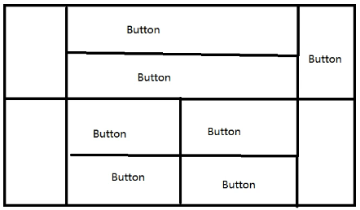

# GUI编程

组件

- 窗口
- 弹窗
- 面板
- 文本框
- 列表框
- 按钮
- 图片
- 监听事件
- 鼠标、键盘事件

## 1、简介

GUI核心：Swing、AWT

缺点：1.界面不美观 2.需要jre环境

重点：了解MVC架构，了解监听

## 2、AWT

### 2.1、AWT简介

1. 包含很多类和接口
2. 元素：窗口、按钮、文本框
3. java.awt


### 2.2、组件和容器

#### 1.Frame窗口

```java
// 第一个案例
package com.cxx.gui;

import java.awt.*;

public class TestFrame {
    public static void main(String[] args) {
        // Frame 源码
        Frame fra = new Frame("java图形界面窗口");
        // 需要设置可见性
        fra.setVisible(true);
        // 设置窗口大小、背景颜色
        fra.setSize(400, 400);
        fra.setBackground(new Color(100, 100, 100));
        fra.setLocation(200, 200);
        fra.setResizable(false);
    }
}
// 第二个案例
package com.cxx.gui;

import java.awt.*;

public class TestFrame1 {
    public static void main(String[] args) {
        MyFrame myFrame1 = new MyFrame(100, 100, 200, 200, Color.DARK_GRAY);
        MyFrame myFrame2 = new MyFrame(100, 100, 300, 300, Color.white);
    }
}

class MyFrame extends Frame{

    static int id = 0;

    public MyFrame(int x, int y,int w,int h,Color color)  {
        super("MyFrame+"+(++id));
        setBackground(color);
        setBounds(x,y,w,h);
        setVisible(true);
    }
}
```

效果图：


####  2.面板Panel

案例

```java
package com.cxx.gui;

import java.awt.*;
import java.awt.event.WindowAdapter;
import java.awt.event.WindowEvent;

public class TestPanel {
    public static void main(String[] args) {
        Frame frame =new Frame();
        Panel panel = new Panel();
        // 设置布局
        frame.setLayout(null);
        // 设置坐标
        frame.setBounds(300,300,500,500);
        frame.setBackground(new Color(207, 207, 208));
        // panel设置坐标，基于frame
        panel.setBounds(50,50,400,400);
        panel.setBackground(new Color(10,10,10));
        frame.add(panel);
        frame.setVisible(true);
        // 设置监听事件，关闭窗口
        // 适配器模式
        frame.addWindowListener(new WindowAdapter() {
            @Override
            public void windowClosing(WindowEvent e) {
                // super.windowClosing(e);
                System.exit(0);
            }
        });
    }
}
```

效果图


### 3.布局管理器

- 流式布局

  ```java
  package com.cxx.gui;
  
  import java.awt.*;
  
  public class TestFlowLayout {
      public static void main(String[] args) {
          Frame frame = new Frame();
          // 组件-按钮
          Button button1 = new Button();
          Button button2 = new Button();
          Button button3 = new Button();
          // 设置流式布局(默认居中)
          frame.setLayout(new FlowLayout());
          // 设置靠左
          // frame.setLayout(new FlowLayout(FlowLayout.LEFT));
          frame.setSize(200,200);
          frame.add(button1);
          frame.add(button2);
          frame.add(button3);
      }
  }
  
  ```

- 东西南北中布局

  ```java
  package com.cxx.gui;
  
  import java.awt.*;
  
  public class TestBorderLayout {
      public static void main(String[] args) {
          Frame frame = new Frame("TestBorderLayout");
          Button east = new Button("East");
          Button wast = new Button("Wast");
          Button south = new Button("South");
          Button north = new Button("North");
          Button center = new Button("Center");
  
          frame.add(east,BorderLayout.EAST);
          frame.add(wast,BorderLayout.WEST);
          frame.add(south,BorderLayout.SOUTH);
          frame.add(north,BorderLayout.NORTH);
          frame.add(center,BorderLayout.CENTER);
          frame.setSize(200,200);
          frame.setVisible(true);
      }
  }
  ```

- 表格布局

  ```java
  package com.cxx.gui;
  
  import java.awt.*;
  
  public class TestGridLayout {
      public static void main(String[] args) {
          Frame frame = new Frame("TestGridLayout");
          Button btn1 = new Button("btn1");
          Button btn2 = new Button("btn2");
          Button btn3 = new Button("btn3");
          Button btn4 = new Button("btn4");
          Button btn5 = new Button("btn5");
          Button btn6 = new Button("btn6");
  
          frame.setLayout(new GridLayout(3,2));
          frame.add(btn1);
          frame.add(btn2);
          frame.add(btn3);
          frame.add(btn4);
          frame.add(btn5);
          frame.add(btn6);
          // pack()Java函数，相当于自动布局
          frame.pack();
          // frame.setSize(200,200);
          frame.setVisible(true);
      }
  }
  ```

**课堂练习**

目标效果图

实现代码

```java
package com.cxx.gui;

import java.awt.*;
import java.awt.event.WindowAdapter;
import java.awt.event.WindowEvent;

public class TestLayout01 {
    public static void main(String[] args) {
        Frame frame = new Frame("ClassTest");
        frame.setLayout(new GridLayout(2,1));
        Button btn1 = new Button("btn1");
        Button btn2 = new Button("btn2");
        Button btn3 = new Button("btn3");
        Button btn4 = new Button("btn4");
        Button btn5 = new Button("btn5");
        Button btn6 = new Button("btn6");
        Button btn7 = new Button("btn7");
        Button btn8 = new Button("btn8");
        Button btn9 = new Button("btn9");
        Button btn10 = new Button("btn10");

        //设置面板
        Panel p1 = new Panel(new BorderLayout());
        Panel p2 = new Panel(new GridLayout(2,1));
        Panel p3 = new Panel(new BorderLayout());
        Panel p4 = new Panel(new GridLayout(2,2));

        // panel布局套娃
        p1.add(btn1,BorderLayout.WEST);
        p2.add(btn2);
        p2.add(btn3);
        p1.add(p2,BorderLayout.CENTER);
        p1.add(btn4,BorderLayout.EAST);
        p3.add(btn5,BorderLayout.WEST);
        p4.add(btn6);
        p4.add(btn7);
        p4.add(btn8);
        p4.add(btn9);
        p3.add(p4,BorderLayout.CENTER);
        p3.add(btn10,BorderLayout.EAST);
        // 加入窗口
        frame.add(p1);
        frame.add(p3);
        frame.setSize(300,300);
        frame.setVisible(true);
        frame.pack();
        frame.addWindowListener(new WindowAdapter() {
            @Override
            public void windowClosing(WindowEvent e) {
                // super.windowClosing(e);
                System.exit(0);
            }
        });
    }
}
```

### 4.事件监听

当某个事件发生时，做什么。

```Java
package com.cxx.gui;

import java.awt.*;
import java.awt.event.ActionEvent;
import java.awt.event.ActionListener;
import java.awt.event.WindowAdapter;
import java.awt.event.WindowEvent;

// 监听按键信息
public class TestAction01 {
    public static void main(String[] args) {
        Frame frame = new Frame("开始-停止");
        Button button1 = new Button("start");
        Button button2 = new Button("stop");
        button1.setActionCommand("start");
        button2.setActionCommand("stop");
        MyMonitor myMonitor = new MyMonitor();
        button1.addActionListener(myMonitor);
        button2.addActionListener(myMonitor);
        frame.add(button1,BorderLayout.NORTH);
        frame.add(button2,BorderLayout.SOUTH);
        frame.pack();
        frame.setVisible(true);
        winClose(frame);
    }
    private static void winClose(Frame frame){
        frame.addWindowListener(new WindowAdapter() {
            @Override
            public void windowClosing(WindowEvent e) {
                System.exit(0);
            }
        });
    }
}

class MyMonitor implements ActionListener{
    @Override
    public void actionPerformed(ActionEvent e) {
        System.out.println("msg-"+e.getActionCommand());
    }
}
```

### 5.输入框TextField监听

```java
package com.cxx.gui;

import java.awt.*;
import java.awt.event.ActionEvent;
import java.awt.event.ActionListener;
import java.awt.event.WindowAdapter;
import java.awt.event.WindowEvent;

public class TestText01{
    public static void main(String[] args) {
        MyFrame1 myFrame1 = new MyFrame1();
        myFrame1.winClose();
    }
}
class MyFrame1 extends Frame{
    public MyFrame1(){
        TextField textField = new TextField();
        add(textField);
        // 监听文本框输入的文字
        MyActionListener1 myActionListener1 = new MyActionListener1();
        textField.addActionListener(myActionListener1);

        // 设置输出显示
        textField.setEchoChar('*');
        setVisible(true);
        pack();

    }
    public void winClose(){
        addWindowListener(new WindowAdapter(){
            @Override
            public void windowClosing(WindowEvent e) {
                System.exit(0);
            }
        });
    }
}

class MyActionListener1 implements ActionListener{
    @Override
    public void actionPerformed(ActionEvent e){
        // 获取一些资源
        TextField field = (TextField) e.getSource();
        System.out.println(field.getText()); //获取输入文本
        field.setText("");//输出后重置输入栏
    }
}
```

### 6.简易计算器


```java
package com.cxx.gui;

import java.awt.*;
import java.awt.event.ActionEvent;
import java.awt.event.ActionListener;
import java.awt.event.WindowAdapter;
import java.awt.event.WindowEvent;

// 简易加法计算器实现
public class TestCalculator{
    public static void main(String[] args) {
        new Calculator();
    }
}

// 计算器类
class Calculator extends Frame{
    public Calculator(){
        // 组件：三个文本框、1按钮和1标签
        TextField num1 = new TextField(10);
        TextField num2 = new TextField(10);
        TextField num3 = new TextField(12);
        Button button = new Button("=");
        Label label = new Label("+");

        setLayout(new FlowLayout());
        add(num1);
        add(label);
        add(num2);
        add(button);
        add(num3);

        // 设置监听器
        button.addActionListener(new MyCalculatorListener(num1,num2,num3));
        pack();
        setVisible(true);

        addWindowListener(new WindowAdapter() {
            @Override
            public void windowClosing(WindowEvent e) {
                System.exit(0);
            }
        });
    }
}

class MyCalculatorListener implements ActionListener{
    private TextField i,j,res;
    public MyCalculatorListener(TextField i,TextField j,TextField k) {
        this.i= i;
        this.j= j;
        this.res=k;
    }
    @Override
    public void actionPerformed(ActionEvent e) {
        // 获得加数和被加数
        int n1 = Integer.parseInt(i.getText());
        int n2 = Integer.parseInt(j.getText());
        // 得到结果,清空输入栏
        res.setText(""+(n1+n2));
        i.setText("");
        j.setText("");
    }
}
```

```java
// 面向对象的写法
// 使用内部类和组合的
package com.cxx.gui;

import java.awt.*;
import java.awt.event.ActionEvent;
import java.awt.event.ActionListener;
import java.awt.event.WindowAdapter;
import java.awt.event.WindowEvent;

// 简易加法计算器实现
public class TestCalculator{
    public static void main(String[] args) {
        new Calculator();
    }
}

// 计算器类
class Calculator extends Frame{
    private TextField num1,num2,num3;
    public Calculator(){
        // 组件：三个文本框、1按钮和1标签
        num1 = new TextField();
        num2 = new TextField();
        num3 = new TextField();
        Button button = new Button("=");
        Label label = new Label("+");

        setLayout(new FlowLayout());
        add(num1);
        add(label);
        add(num2);
        add(button);
        add(num3);

        // 设置监听器
        button.addActionListener(new MyCalculatorListener());
        pack();
        setVisible(true);

        addWindowListener(new WindowAdapter() {
            @Override
            public void windowClosing(WindowEvent e) {
                System.exit(0);
            }
        });
    }
    
   	// 使用内部类，可以自由访问外部的属性和方法
    private class MyCalculatorListener implements ActionListener{
        @Override
        public void actionPerformed(ActionEvent e) {
            // 获得加数和被加数
            int n1 = Integer.parseInt(num1.getText());
            int n2 = Integer.parseInt(num2.getText());
            // 得到结果,清空输入栏
            num3.setText(""+(n1+n2));
            num2.setText("");
            num1.setText("");
        }
    }
}
```

### 7.画笔

```java
package com.cxx.gui;

import java.awt.*;
import java.awt.event.WindowAdapter;
import java.awt.event.WindowEvent;

public class TestPaint {
    public static void main(String[] args) {
        MyPaint myPaint = new MyPaint();
        myPaint.loadFrame();
    }
}

class MyPaint extends Frame {
    public void loadFrame(){
        setBounds(200,200,600,600);
        setVisible(true);
		
        addWindowListener(new WindowAdapter() {
            @Override
            public void windowClosing(WindowEvent e) {
                System.exit(0);
            }
        });
    }
	// 画笔
    public void paint(Graphics graphics){
        // 设置颜色和形状
        graphics.setColor(Color.BLUE);
        graphics.fillOval(50,50,50,50);
        graphics.setColor(Color.GRAY);
        graphics.fillRect(150,200,100,100);
        // 画笔使用完，需要还原颜色
    }
}
```

### 8.鼠标监听

```java
package com.cxx.gui;

import java.awt.*;
import java.awt.event.MouseAdapter;
import java.awt.event.MouseEvent;
import java.awt.event.MouseListener;
import java.util.ArrayList;
import java.util.Iterator;
import java.util.logging.FileHandler;

public class TestMouseListener {
    public static void main(String[] args) {
        new MyFrame2("鼠标监听");
    }
}

class MyFrame2 extends Frame{
    ArrayList points;
    public MyFrame2(String title)  {
        super(title);
        // 设置画布
        setBounds(200,200,500,500);
        // 存放鼠标点击位置的点
        points =new ArrayList<>();
        // 鼠标监听器
        this.addMouseListener(new MyMouseListener());
        setVisible(true);
    }

    public void paint(Graphics g) {
        // 画画，监听鼠标事件
        Iterator iterator = points.iterator();
        while (iterator.hasNext()){
            Point next = (Point) iterator.next();
            g.setColor(Color.BLACK);
            g.fillOval(next.x,next.y,10,10);
        }
    }
    // 适配器模式
    private class MyMouseListener extends MouseAdapter{
        @Override
        public void mousePressed(MouseEvent e){
            MyFrame2 frame =(MyFrame2) e.getSource();
            // 绘制鼠标点击的点
            frame.addPaint(getMousePosition());
            // 每次点击要继续画
            frame.repaint();
        }
    }
	// 加点
    private void addPaint(Point mousePosition) {
        points.add(mousePosition);
    }
}
```

效果图


### 9.窗口监听

```java
package com.cxx.gui;

import java.awt.*;
import java.awt.event.WindowAdapter;
import java.awt.event.WindowEvent;

public class TestWindow {
    public static void main(String[] args) {
        new windowFrame();

    }
}

class windowFrame extends Frame{
    public windowFrame(){
        setBounds(100,100,300,300);
        setBackground(Color.CYAN);
        setVisible(true);
//        addWindowListener(new MyWindowListener());
        // 采用匿名内部类
        this.addWindowListener(new WindowAdapter() {
            // 关闭
            @Override
            public void windowClosing(WindowEvent e) {
                System.out.println("关闭弹窗");
                System.exit(0);
            }
            // 激活（最小化到显示）
            @Override
            public void windowActivated(WindowEvent e) {
                System.out.println("激活弹窗");
            }
        });
    }

//    class MyWindowListener extends WindowAdapter{
//        @Override
//        public void windowClosing(WindowEvent e) {
//            setVisible(false);
//            System.exit(0);
//        }
//    }
}
```

### 10.键盘监听

```java
package com.cxx.gui;

import java.awt.*;
import java.awt.event.KeyAdapter;
import java.awt.event.KeyEvent;
import java.awt.event.WindowAdapter;
import java.awt.event.WindowEvent;

public class TestKeyListener {
    public static void main(String[] args) {
        new KeyFrame();

    }
}

class KeyFrame extends Frame{
    public KeyFrame(){
        setBounds(100,100,300,300);
        setVisible(true);
        this.addKeyListener(new KeyAdapter() {
            @Override
            public void keyTyped(KeyEvent e) {
                super.keyTyped(e);
            }
            // 键盘按下
            @Override
            public void keyPressed(KeyEvent e) {
                // 获取按键信息
                super.keyPressed(e);
                System.out.print("按键"+e.getKeyChar()+"\t");
            }
            // 松开按键
            @Override
            public void keyReleased(KeyEvent e) {
                super.keyReleased(e);
                System.out.println("code="+e.getKeyCode());
            }
        });

        this.addWindowListener(new WindowAdapter() {
            @Override
            public void windowClosing(WindowEvent e) {
                setVisible(false);
                System.exit(0);
            }
        });
    }
}
```

## 3、Swing

### 1.窗口、面板JFrame

```java
package com.cxx.gui;

import javax.swing.*;
import java.awt.*;

public class JFrameDemo {
    public static void main(String[] args) {
        new MyJFrame().init();
    }
}

class MyJFrame extends JFrame{
    public void init(){
        this.setBounds(100,100,400,400);
        this.setVisible(true);

        JLabel label = new JLabel("welcome to JFrame");
        // 设置居中
        label.setHorizontalAlignment(SwingConstants.CENTER);
        this.add(label);

        // 获取一个容器
        Container container = this.getContentPane();
        container.setBackground(Color.white);
        // 不同于Frame，使用容器退出
        this.setDefaultCloseOperation(WindowConstants.EXIT_ON_CLOSE);
    }
}
```

### 2.弹窗

```java
package com.cxx.gui;

import javax.swing.*;
import java.awt.*;


public class DialogDemo extends JFrame {
    public static void main(String[] args) {
        new DialogDemo();
    }
    public DialogDemo(){
        this.setVisible(true);
        this.setSize(  500,500);
        this.setDefaultCloseOperation(WindowConstants.EXIT_ON_CLOSE);
        // 放容器
        Container container = this.getContentPane();
        // 绝对布局
        container.setLayout(null);
        // 按钮
        JButton jB = new JButton("弹出对话框");
        jB.setBounds(20,20,100,100);
        // 点击弹出一个弹窗
        jB.addActionListener(e -> new MyDialogDemo());
        this.add(jB);
    }
}

class MyDialogDemo extends JDialog{
    public MyDialogDemo(){
        this.setVisible(true);
        this.setSize(  200,100);
        // 弹窗默认有退出，所以下列代码重复
        // this.setDefaultCloseOperation(WindowConstants.EXIT_ON_CLOSE);

        Container container = this.getContentPane();
        container.setLayout(null);
        container.add(new Label("hello"));
    }
}
```

### 3.标签

```java
package com.cxx.gui;

import javax.swing.*;
import java.awt.*;
import java.net.URL;

public class ImageIconDemo extends JFrame {
    public ImageIconDemo() {
        // 图片路径待定
        JLabel label = new JLabel("ImageIcon");
        URL url = ImageIconDemo.class.getResource("");

        ImageIcon imageIcon = new ImageIcon(url);
        label.setIcon(imageIcon);
        label.setHorizontalAlignment(SwingConstants.CENTER);

        Container container = getContentPane();
        container.add(label);

        setVisible(true);
        setDefaultCloseOperation(WindowConstants.EXIT_ON_CLOSE);
        setBounds(100,100,400,400);
    }

    public static void main(String[] args) {
        new ImageIconDemo();
    }
}
```

### 4.面板

#### JPanel

```java
package com.cxx.gui;

import javax.swing.*;
import java.awt.*;

public class JPanelDemo extends JFrame {
    public static void main(String[] args) {
        new JPanelDemo();
    }
    public JPanelDemo(){
        Container container = this.getContentPane();
        // 增加的参数为间距
        container.setLayout(new GridLayout(2,1,10,10));

        JPanel panel1 = new JPanel(new GridLayout(1,2));
        panel1.add(new JButton("1"));
        panel1.add(new JButton("2"));

        container.add(panel1);

        this.setVisible(true);
        this.setSize(200,200);
        this.setDefaultCloseOperation(WindowConstants.EXIT_ON_CLOSE);
    }
}

```

#### JScroll(滚动)

```java
package com.cxx.gui;

import javax.swing.*;
import java.awt.*;

public class JScrollDemo extends JFrame {
    public JScrollDemo(){
        Container container = this.getContentPane();
        // 文本域
        JTextArea textArea = new JTextArea(20,50);
        textArea.setText("你好");
        // Scroll面板
        JScrollPane scrollPane = new JScrollPane(textArea);
        container.add(scrollPane);

        this.setVisible(true);
        this.setBounds(100,100,300,400);
        this.setDefaultCloseOperation(WindowConstants.EXIT_ON_CLOSE);
    }

    public static void main(String[] args) {
        new JScrollDemo();
    }
}

```

### 5.按钮

-  普通按钮

  

- 单选按钮

  单选框只能从一组选项中选取一个，因此需要先对选项分组     

  

- 多选框

  ```java
  package com.cxx.gui;
  
  import javax.swing.*;
  import java.awt.*;
  import java.net.URL;
  
  public class JButtonDemo extends JFrame {
      public JButtonDemo(){
          Container container = this.getContentPane();
          URL resource = JScrollDemo.class.getResource("路径");
          Icon icon = new ImageIcon(resource);
          //多选框
          JCheckBox checkBox1 = new JCheckBox("选项1");
          JCheckBox checkBox2 = new JCheckBox("选项2");
          container.add(checkBox1,BorderLayout.NORTH);
          container.add(checkBox2,BorderLayout.SOUTH);
  
          this.setVisible(true);
          this.setSize(400,400);
          this.setDefaultCloseOperation(WindowConstants.EXIT_ON_CLOSE);
      }
      public static void main(String[] args) {
          new JButtonDemo();
      }
  }
  ```

### 6.列表

- 下拉框

  ```java
  import javax.swing.*;
  import java.awt.*;
  
  public class TestComboboxDemo01 extends JFrame {
      public static void main(String[] args) {
          new TestComboboxDemo01();
      }
      public TestComboboxDemo01(){
          Container container = this.getContentPane();
          JComboBox status = new JComboBox();
          status.setToolTipText("请选择：");
          status.addItem(null);
          status.addItem("choice1");
          status.addItem("choice2");
          status.addItem("choice3");
  
          container.add(status);
  
          this.setVisible(true);
          this.setSize(300,300);
          this.setDefaultCloseOperation(WindowConstants.EXIT_ON_CLOSE);
      }
  }
  
  ```

- 列表框

  ```
  
  ```

  

### 7.文本框

- 文本框

  ```java
  public TestDemo01 extends JFrame{
      public TestDemo01(){
          Container container = this.getContentPane();
          JTextField textField1 = new JTextField("hello");
          JTextField textField2 = new JTextField("world",20);
          container.add(textField1,BorderLayout.NORTH);
          container.add(textField2,BorderLayout.SOUTH);
          this.setVisible(true);
          this.setSize(500,350);
    this.setDefaultCloseOperation(WindowConstants.EXIT_ON_CLOSE);
      }
      Public static void main(String[] arg){
          new TestDemo01();
      }
  }
  ```

  

- 密码域

  ```java
  public TestDemo01 extends JFrame{
      public TestDemo02(){
          Container container = this.getContentPane();
          JPasswordField pw = new JPasswordField();
          pw.setEchoChar('*');
          container.add(pw)
          this.setVisible(true);
          this.setSize(500,350);
    this.setDefaultCloseOperation(WindowConstants.EXIT_ON_CLOSE);
      }
      Public static void main(String[] arg){
          new TestDemo02();
      }
  }
  ```

  

- 文本域

  ```java
  package com.cxx.gui;
  
  import javax.swing.*;
  import java.awt.*;
  
  public class JScrollDemo extends JFrame {
      public JScrollDemo(){
          Container container = this.getContentPane();
          // 文本域
          JTextArea textArea = new JTextArea(20,50);
          textArea.setText("你好");
          // Scroll面板
          JScrollPane scrollPane = new JScrollPane(textArea);
          container.add(scrollPane);
  
          this.setVisible(true);
          this.setBounds(100,100,300,400);
          this.setDefaultCloseOperation(WindowConstants.EXIT_ON_CLOSE);
      }
  
      public static void main(String[] args) {
          new JScrollDemo();
      }
  }
  
  ```

  

## 4.贪吃蛇绘制

1.游戏主启动类

```java
package snake;
import javax.swing.*;

// 游戏主启动类
public class StartGame{
	psvm{
		JFrame frame = new JFrame;
		frame.setBounds(10,10,900,700);
		frame.setResizable(false);
		frame.setDefaultCloseOperation(WindowConstarts.EXIT_ON_CLOSE);
		frame.setVisible(true);
	}
}
```

2.游戏面板

```java
package snake;
import javax.swing.*;
import java.awt.*;
import java.event.ActionListener;
import java.event.KeyEvent;
import java.event.KeyListener;
// 游戏面板
public class GamePanel extends JPanel implements KeyListener,ActionListener{
	// 定义蛇的数据结构
    int length;
    //snakeX和Y分别代表蛇的某节对应的x，y坐标。注意：蛇的坐标个数与界面单位块相关，此处为25*25，理论最多625节
    int[] snakeX = new int[600]; 
    int[] snakeY = new int[600];
    String direction = "R";
    
    // 食物的坐标
    Random rd = new Random();
    int foodX,foodY;
    
    // 游戏状态，初始化为停止
    Boolean isStart = false;
    Boolean isFail = false;
    
    // 定时器
    Timer timer = new Timer(200,this)// 200ms执行一次
    
    public GamePanel{
        init();
        // 获取焦点和键盘事件
        this.setFocusable(true);// 获得焦点事件
        this.addKeyListener(this);// 获得
        timer.start();// 启动游戏就开启计时器
    }
    
    // 初始化方法
    public void init(){
        length =3;
        snakeX[0]=100;snakeY[0]=100; // 蛇的头部
        snakeX[1]=75;sankeY[1]=100; // 蛇的第二节
        snakeX[2]=50;sankeY[2]=100; // ...
        
        foodX = 25+25*rd.nextInt(33);
        foodY = 25+25*rd.nextInt(24);
    }
    
    // 绘制面板，游戏所有实现都是画笔绘制
    @override 
	protected void paintCompoent(Graphics g){
		super.paintComponent(g);// 清屏
        // 绘制静态面板
        Data.header.paintIcon(this.g,25,11)// 画上广告栏
        g.fillRect(25,75,850,600) // 默认的游戏界面
        this.setBackgroud(Color.BLACK);
        // 画食物
       Data.food.paintIcon(this.g,foodX,foodY);	
        // 绘制小蛇
        // 头部，初始为右
        switch(direction){
            case "L":
Data.left.paintIcon(this.g,snakeX[0],snakeY[0]);
            case "R":               Data.right.paintIcon(this.g,snakeX[0],snakeY[0]);
            case "U":
Data.up.paintIcon(this.g,snakeX[0],snakeY[0]);
            case "D":               Data.down.paintIcon(this.g,snakeX[0],snakeY[0]);
            default:
                break;
        }
        for(int i=1; i<length; i++){
            // 身体
            Data.body.paintIcon(this.g,snake[i],snake[i]);
        }
        // 游戏状态
        // 开始判定
        if(isStart == false){
            g.setColor(Color.white);
            g.setFont(new Font("微软雅黑",Font.BOLD,40));
            g.drawString("按空格开始游戏"，300,250);
        }
        // 失败判定
        if(isFail){
            g.setColor(Color.RED);
            g.setFont(new Font("微软雅黑",Font.BOLD,40));
            g.drawString("游戏失败，按空格重新开始"，300,250);
        }
        

    }
    // 键盘监听事件
    @Override
    public void keyPressed(KeyEvent e){
        int keyCode = e.getKeyCode();
        if(keyCode == KeyEvent.VK_SPACE){
            if(isFail){
                
            }else{ 
                isStart =!isStart;// 取反，空格可以启停
            }
            repaint();
        }
        // 小蛇移动
        if(keyCode==KeyEvent.VK_DOWN){
            direction = "D";
        }else if(keyCode==KeyEvent.VK_LEFT){
            direction = "L";
        }else if(keyCode==KeyEvent.VK_RIGHT){
            direction = "R";
        }else if(keyCode==KeyEvent.VK_UP){
            direction = "U";
        }
    }
    // 事件监听---通过固定事件刷新游戏界面
    public void actionPerformed(ActionEvent e){
        if(isStart&&isFail == false){ //游戏是开启状态
            // 吃食物
            if (snakeX[0] == foodX && snakeY[0] == foodY){
                length++;
                // 再次随机食物位置
                foodX = 25+25*rd.nextInt(33);
        		foodY = 25+25*rd.nextInt(24);
            }
            // 移动
            // 先动尾后头
            for(int i = length-1;i>0;i--){
                snakeX[i] = snakeX[i-1];
                snakeY[i] = snakeY[i-1];
            }
            // 走向和边界判断
            if(direction.equals('R')){snakeX[0]=snakeX[0]+25;if(snakeX[0]>850){
            	snakeX[0] = 25;
        	}}
            else if(direction.equals('U')){snakeY[0]=snakeY[0]-25;if(snakeY[0]<25){
            	snakeY[0] = 600;
        	}}
            else if(direction.equals('D')){snakeY[0]=snakeY[0]+25;if(snakeY[0]>600){
            	snakeY[0] = 25;
        	}}
            else if(direction.equals('L')){snakeX[0]=snakeX[0]-25;if(snakeX[0]<0){
            	snakeX[0] = 850;
        	}}
            
            
            // 失败判定
            for(int i= 1;i<length;i++){
                if(snakeX[0]==snakeX[i]&&snakeY[0]==snakeY[i];){
                    isFail = true;
                }
            }
            // 更新画面
            repaint();
        }
        timer.start();
    }
    
    @Override
    public void keyReleased(KeyEvent e){}
    @Override
    public void keyTyped(KeyEvent e){}
}
```

3.数据类

```java
package snake;

// 数据中心
public class Data{
	// 头部广告图标
	private static  URL headerURL = Data.class.getResource("filepath");
	public static ImageIcon header = new ImageIcon(headerURL);
	// 上下左右类似
	private static  URL upURL = Data.class.getResource("filepath1");
	public static ImageIcon header = new ImageIcon(upURL);
    private static  URL downURL = Data.class.getResource("filepath2");
	public static ImageIcon down = new ImageIcon(downURL);
	private static  URL leftURL = Data.class.getResource("filepath3");
	public static ImageIcon left = new ImageIcon(leftURL);
	private static  URL rightURL = Data.class.getResource("filepath4");
	public static ImageIcon right = new ImageIcon(rightURL);
    // 身体和食物
    private static  URL bodyURL = Data.class.getResource("filepath5");
	public static ImageIcon body = new ImageIcon(bodyURL);
    private static  URL foodURL = Data.class.getResource("filepath6");
	public static ImageIcon food = new ImageIcon(foodURL);
}

```


## 附录

### 1.idea快捷键

ctrl+/ 多行注释