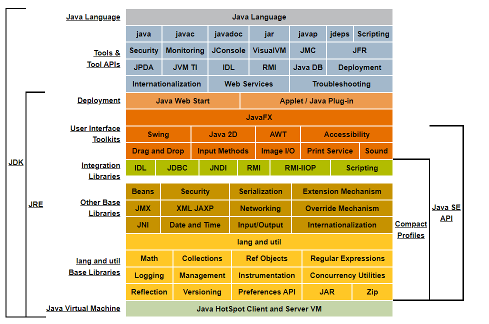
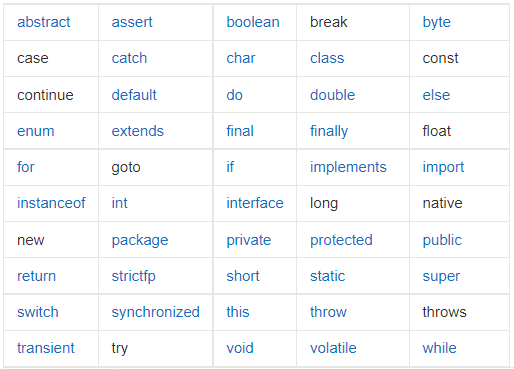

# java基础阶段（一）

[java学习路线]([Java学习完整路线，强烈建议收藏转发 - 哔哩哔哩 (bilibili.com)](https://www.bilibili.com/read/cv5702420?spm_id_from=333.999.list.card_article.click))

## 概念

### 1.java特性和优势

- 简单性

- 面向对象

- 可移植性

- 高性能

- 分布式

- 动态性

  反射机制

- 多线程

- 安全性

- 健壮性

### 2.java三大版本

- JavaSE：标准版（桌面控制，控制台开发）
- JavaME：嵌入式开发
- JavaEE：E企业级开发（web端，服务器开发）

### 3.JDK、JRE、JVM

- JDK：Java Development Kit

- JRE：Java Runtime Environment

- JVM:  JAVA Vitrual Machine

  

### 4.环境搭建

- jdk下载安装
- 环境变量配置
- JDK目录介绍
- helloworld及简单语法规则

新建`helloworld.java`文件

代码如下：

```java
public class hellowworld {
    public static  void  main (String[] args){
        System.out.print("Hello,World!");
    }
}
```


### 5.Java运行机制

**两种类型**

- 编译型

- 解释型

  两者区别：前者需要先编译后运行，后者可以边解释边运行。

编译型语言：C/C++

解释型语言：JavaScript、python等

<u>Java兼具两种类型，实际运行时是先完成编译，在虚拟环境中再解释</u>

### 6.安装idea（略）


## 入门

### 1.注释、标识符、关键字

#### **注释**

- 单行注释
- 多行注释
- 文档注释

```java
//单行注释

/*
多行注释 
*/

/**文档注释
 *@Description Hellowworld
 */
```

#### **标识符**

类名、变量名以及方法名都被称为标识符。

**注意：**

1.所有标识符必须以字母、美元符号、下划线开始。其后可以是之前种类或数字的任何字符组合。

2.关键字不可作为变量名和方法名

3.标识符大小写敏感的

4.不建议使用中文命名，不简洁

#### **关键字**



### 2.数据类型

- 强类型语言

  所有变量必须先定义后才使用，如C、C++、Java

- 弱类型语言

  变量无需先定义，如JavaScript

#### 主要数据类型

- 基本类型：包括数值类型（整数、浮点，字符）和布尔型。
  - 整数类型：byte占1字节，short占2字节，int占4字节，long占8字节
  - 浮点类型：float占4字节，double占8字节。
  - 字符类型：char 占2字节。
  - boolean类型：占1位，值仅有TRUE和FALSE。

- 引用数据类型：类、接口、数组。

  **整数拓展：**二进制0b，八进制0，十六进制0x开头

  **浮点数扩展：**最好不要用浮点数去比较

  **转义字符**：单/标识，如`/t`、`/n`

### 3.类型转换

**强制转换：**（类型）变量名  位长高到低

**自动转换：** 位长低到高

**注意：**

1.不能对布尔值进行转换

2.不能将对象类型转换为不相干类型

3.转换的时候，可能存在内存溢出或精度问题

### 4.变量

每个变量都必须声明其类型。java中的变量是程序中最基本的存储的单元换，要素包括变量名，变量类型和作用域

```java
type varName [=value][{,varName[=value]}];
//数据类型 变量名=值；
```

#### 变量作用域

- 类变量
- 实例变量
- 局部变量

eg：

```java
public class Variable{
	static int allclicks=0;		//类变量
	String str= "hello world";	//实例变量
	
	public void method(){
		int i=0;				//局部变量
	}
}
```

#### 常量

初始化后，不能进行改变的值（Constant）。

```java
final 常量名 = 值;
final double PI = 3.14;
//常量名一般使用大写字符
```

**命名规范**

- 所有变量、方法、类名：见名知意
- 类成员变量：首字母小写和驼峰原则（出第一个单词外，后面在单词首字母大写）
- 局部变量：同上
-  常量：大写字母和下划线
- 类名：首字母大写和驼峰原则
- 方法名：首字母小写和驼峰原则

### 5.运算符

- 算数运算符：+，-，*，/,%,++,--

- 赋值运算符：=

- 关系运算符：>,<,>=,<=,==,!= instanceof

- 逻辑运算符: &&,||,!

- 位运算符: &,|,^,~,>>,<<,>>>

- 条件运算符: ?:

- 扩展复制运算符: +=,-=,*=,/=

  **补充**

  ```java
  public class demo1 {
      public static void main(String[] args) {
          int a = 10;
          int b = 20;
  
          // 字符串连接符+,
          // +号对象中包含string，其结果为string
          System.out.println(""+a+b);
          System.out.println(a+b+"");
          //结果前者为1020,后者为30
      }
  }
  ```

  #### 运算优先级

  

### 6.包机制和JavaDoc

**包机制**用于区分类名的命名空间

包语句的语法格式为：

```java
package pkg1[.pkg2[.pkg3]]	
```

导入包，使用"import"语句即可

```java
import package1[.package2...].(classname|*)
```


**Javadoc** 命令是用来生成API文档的

参数信息

- @author作者名
- @version版本号
- @since最早使用的JDK版本
- @param参数名
- @return返回值
- @throws异常抛出情况

使用方式：cmd命令行生成或idea中生成（注意参数设置包括-encoding，-charset UTF-8）

## 流程控制

### 用户交互Scanner

**Scanner类**是用来获取用户输入的。基本语法如下：

```java
Scanner s = new Scanner(System.in); 
//注意使用Scanner.close()关闭接受数据，节省系统资源
```

通过Scanner类的`next()`和`nextline()`方法获取输入的字符串，在读取前我们可以使用`hasNext()`和`hasNextLine()`判断是否还有输入的数据。

- `next()`
  1. 一定要读到有效字符才可以结束输入。
  2. 输入字符前的空白，方法会自动去掉。
  3. 输入字符后的空白会作为分隔符或者结束符。
  4. next（）不能获取带空格的字符串。
- `nextline()`
  1. 以enter为结束符，也就是说`nextline()`方法返回的是输入回车之前的所有字符。
  2. 可以获取空白。

**注意**

此类还有很多针对特定类型的方法，如 `hasNextInt()`、 `hasNextFloat()`等


### 顺序结构

JAVA的基本结构，也是最简单的算法结构。


### 选择结构

- if结构

  1. 单选择

     ```java
     if(判断表达式){
     }
     ```

  2. 双选择

     ```java
     if(判断表达式){
     	//为真
     }else{
     	//为假
     }
     ```

  3. 多选择

     ```java
     if(判断表达式1){
     	//表达式1为真
     }else if(判断表达式2){
     	//表达式2为真
     }else if(判断表达式3){
     	//表达式3为真
     }else{
     	//上述表达式皆为假
     }
     ```

  4. 嵌套

     ```java
     if(表达式1){
     	//表达式1为真
     	if(表达式2){
     		//表达式2为真
             ...
     	}
     }
     ```

- switch多选择结构

switch case 语句判断一个变量与一系列值中的某个值是否相相等，每个值为一个分支。结构如下：

```java
switch (表达式){
	case value1:
		//语句
		break;//可选
	case value2:
		//语句
		break;//可选
    case value3:
		//语句
		break;//可选
		...
	default:
    	//默认语句
}
```

**注意：**

- Switch支持byte、short、int、char、String。

- case 标签必须是字符串常量或字面量。

- 如果当前case下没有break，会执行后面case。

  

### 循环结构

- while循环

  ```java
  while(表达式){
  	//循环内容
  }
  ```

  **注意：**

  需要设置循环结束的语句，避免死循环

- do ...while循环

  ```java
  do{
  	//循环内容
  }while(表达式);
  ```

  **注意：**

  1. while先判断后执行，do while是先执行后判断
  2. do while的循环体至少执行一次

- for循环

  ```java
  for(初始化;表达式;更新){
  	//循环内容
  }
  ```

  **注意：**

  1. ​	for支持迭代，结构更灵活	

- 增强for循环

  主要用于数组或者集合

  ```java
  //声明语句：声明新的局部变量，该变量的类型必须和数组元素的类型匹配。作用域仅限定在循环语句块，其值与数组元素的值相等。
  //表达式：为要访问的数组名，或者返回值为数组的方法
  for(声明语句:表达式)
  {
  	//代码
  }
  
  ```

### break&continue

break用于强行终止循环（Switch中也会用到），continue用终止循环中的某一次循环，即跳过循环体内未执行的语句，接着执行是否进行下一循环的判定。

### **dubug使用**

设置断点

## 方法

方法是语句的集合，执行一个功能

- 方法是解决一类问题的步骤的有序组合
- 方法包含于类或者对象中
- 方法在程序中被创建，在其他地方被引用

设计方法的原则：一个方法只完成一个特定功能，有利于后期扩展。

### 方法的定义及调用

#### 定义

方法包含一个方法头和方法体

- 修饰符：可选，定义方法的访问类型

- 返回值类型：方法可能会返回值（有则为具体类型，否则为void）

- 方法名：方法的实际名称，方法名和参数表共同构成方法签名

- 参数类型：参数像是一个占位符，可选的。参数列表是指方法的参数类型、顺序和参数个数。

  **补充：** 

  形参：在方法被调用时用于接收外界输入的数据

  实参：调用方法时实际传给方法的数据

- 方法体：具体的语句，定义方法的功能

  ```
  修饰符 返回值 方法名 （参数类型 参数名）{
  	...
  	方法体
  	...
  	return 返回值;
  }
  // return 0 用于终止方法
  ```

#### 调用

调用方法：对象名.方法名（实参列表）

**注意**

**值传递：**在调用函数时，将实际参数复制一份传递到函数中，这样在函数中对参数进行修改，就不会影响到原来的实际参数；（需要创建新空间，额外占内存）

**引用传递：** 在调用函数时，将实际参数的地址直接传递到函数中。这样在函数中对参数进行的修改，就会影响到实际参数；（不需要新空间）

### 方法的重载

重载是在一个类中，有同函数名称，但形参不同的函数。

**重载的规则：**

- 方法名称必须相同
- 参数列表必须不同（个数，类型，排列）
- 方法的返回类型可以相同
- 返回类型不同不构成重载

### 命令行传参

如果想在程序运行时再传递消息，这要靠传递命令行参数给main（）函数实现

```java
public class CommandLine{
	public static void main(String arg[]){
		for(int i=0;i<args.length;i++){
			System.out.println("args["+i+"]:"+args[i]);
		}
	}
}
```

**注意：**必须在主类目录下使用java命令运行，并提供参数。（需要提前javac编译）

```
src> java com.kuang.method.Demo this is example 
```

### 可变参数

java支持传递同类型的可变参数给一个方法，在方法声明中，在指定参数类型后加一个省略号（...）

- 一个方法只能指定一个可变参数，它必须是方法的最后一个参数。其他参数必须在它之前声明。

```java
public class Test01{
	public static void main(String arg[]){
		// 调用可变参数的方法
		printMax(...number:34,3,3,2,56);
		printMax(new double[]{1,2,3});
	}
	
	public static printMax(){
		if(numbers.length == 0){
			System.out.println("No argument passed");
			return;
		}
		double result = number[0];
		
		//排序
		for(int i=1;i<number.length;i++){
			if(numbers[i]>result){
				result = number[i];
			}
		}
        system.out.println("The max value is " + result);
	}
}
```

**注意：**`可变参数`本质是一个数组

### 递归

递归实际就是：方法自己调用自己，非循环

- 递归头：递归的结束条件
- 递归体：递归的条件

## 数组

定义： 相同数据类型的**有序**集合

其中每个数据称作数组元素，每个元素都可以通过下标来访问。

####  数组声明创建

声明的语法：

```java
dataType[] arrayRefVar;//首选方法
dataType arrayRefVar[];//C/C++风格
```

java语言使用new操作符来创建数组，语法：

```
dataType[] arrayRefVar = new dataType[arraySize];
```

数组元素是通过索引访问的，从零开始

获得数组长度：`array.length`

**内存分析**

java内存主要包含三种

- 堆：存放new的对象和数组，可以被所有线程共享，不会存放别的对象引用
- 栈：存放基本变量类型，引用对象的变量
- 方法区：可以被所有线程共享，包含所有class和static变量

**数组初始化**

- 静态初始化

  ```
  int[] a = {1,2,3}
  man[] mans = {new Man(1,1),new Man(2,2)}
  ```

- 动态初始化(先声明后初始化)

  ```
  int[] a = new int[2]
  a[0]=1;
  a[1]=2;
  ```

- 默认初始化

  数组是引用类型，它的元素相当于类的实例变量，因此一经分配空间，其中每个元素也被隐式初始化了。

**数组四个特点**

1. 数组长度是确定的，一经创建不可改变
2. 数组元素类型一致
3. 数组元素可以是任何数据类型
4. 数组变量属于引用类型，数组可以看成对象，每个元素相当于对象的成员变量
5. 数组本身就是对象，在java 中是存放在堆中的

**数组边界**

下标合法区间[0,length-1]

#### 数组使用

 for-Each循环

```java
//第一种
for(int i=0;i<arrays.length;i++){
	...//打印、累加等
}
//第二种，没有下标
for(int array:arrays){
	...//同上
}
```

数组作方法入参和数组作返回值

```java
//反转数组
public static int[] reverse(int[] arrays){
	int[] result = new int[arrays.length];
	for(int i=0;i<result.length;i++){
		result[i]=arrays[result.length-i-1];
	}
	return result; 
}

```

#### 多维数组

多维数组实际是数组的元素就是数组，以**二维数组**为例

```java
int a[][]= new int[2][5]
```

#### Arrays类

数组的工具类java.util.Arrays,其中的方法都是static修饰的静态方法，可以直接使用类名进行调用。

具有以下常用功能：

- 赋值：fill方法
- 排序：sort 方法
- 比较：equals方法（比较元素值）
- 查找：binarySeach方法（对有序数组进行二分查找）

**学习类的方法**

查看对应类的源码，通过structure查看具体的方法

#### 稀疏数组（了解）

一个数组中大部分元素为0（或同一数值），可以使用稀疏数组保存。处理方式如下：

- 记录数组的行列数以及不同值
- 将具体数值存入到一个小规模数组中

```java
//稀疏数组转化实例
public class forEach {
    public static void main(String[] args) {
        int[][] arr1 = new int[11][11];
        arr1[1][2]=1;
        arr1[2][1]=2;
        int[][] arr2 = change(arr1);
        //打印原数组
        System.out.println("原数组如下:");
        for (int[] ints : arr1) {
            for (int anInt : ints) {
                System.out.print(anInt+"\t");
            }
            System.out.println();
        }
        //打印数组
        System.out.println("====================================================");
        System.out.println("稀疏数组如下:");
        for (int[] ints : arr2) {
            for (int anInt : ints) {
                System.out.print(anInt+"\t");
            }
            System.out.println();
        }
    }

    public static int[][] change(int[][] arrays) {
        //读取原数组信息
        int count = 0;
        for (int i = 0; i < arrays.length; i++) {
            for (int j = 0; j < arrays[i].length; j++) {
                if(arrays[i][j]!=0){
                    count++;
                }
            }
        }
        int[][] result = new int[count+1][3];
        result[0][0] = arrays.length;
        result[0][1] = arrays[0].length;
        result[0][2] = count;
        int temp =0;
        for (int i = 0; i < arrays.length; i++) {
            for (int j = 0; j < arrays[i].length; j++) {
                if(arrays[i][j]!=0){
                    temp++;
                    result[temp][0]=i;
                    result[temp][1]=j;
                    result[temp][2]=arrays[i][j];
                }
            }
        }
        return result;
    }
}

```


## 面向对象（Object-oriented programming，OOP）

### 概念

- 面向过程思想（按步骤处理）
- 面向对象思想（按类型分别再按步骤处理）

面向对象编程本质就是：以类的方式组织代码，以对象的组织封装数据。


### 回顾方法定义和调用

方法的定义

- 修饰符

- 返回类型

- break和return的区别

  前者跳出循环和Switch，后者为方法返回； 

- 方法名

- 参数列表

- **异常抛出**

方法的调用

- 静态方法：有static修饰，可以通过类名直接调用（和类一起加载）
- 非静态方法：要实例化，创建对象再调用（类实例化）
- 形参和实参
- 值传递和引用传递
- **this关键字**


### 类与对象的创建

#### **类与对象的关系**

- 类是一种抽象的数据类型，它是对某一类事物整体描述、定义，但并不能代表某一个具体的事物。
- 对象是抽象概念的具体实例

#### **创建与初始化队象**

- 使用new关键字创建对象

  创建时，分配内存空间还会给创建的对象进行默认的初始化以及对类中**构造器**的调用

#### **构造器**

又名构造方法，在创建对象时必须调用，主要用于值的初始化。特点如下：

- 1.必须与类名一致
- 2.必须没有返回类型

注意：

1.默认构造都是无参的，也可以自行定义有参构造。一旦定义了有参构造，无参就必须显式定义。

2.`alt+insert`一键生成构造器

#### **内存分析**


对象通过引用操作，引用本质：**栈——>堆**

### 面向对象的三大特性

#### **封装**

禁止对象中数据的直接访问，通过接口的方式来访问，这称为信息隐藏（**属性私有，get/set**）

注意：`alt+insert`也可以生成get和set方法


#### **继承**

关键字`extends`意为“扩展”，继承中被继承的为父类（基类），继承的类为子类（派生类）

注意：

1.java类中无多继承（接口可以多继承）

2.继承是类之间的关系，除此之外，还有依赖、组合和聚合等

3.继承不包含私有的属性和方法


**object类**

java中所有类都继承**object类**

**super**

super可以访问父类中的属性和方法，`this()`调用子类的构造器，而`super()`调用父类的构造器

注意：

1.调用父类的构造器，必须在子类构造器的第一行

2.super必须出现在子类的方法或者构建方法中

3.super和this不能同时调用构造方法


#### 多态

多态即同一个方法可以根据发送对象的不同而采用多种不同的行为方式

一个对象的实际类型是确定的，但指向对象的应用类型可以不同

eg：`Father p1 = new Son();`和`Son p2 = new Son()`

**注意**

1.多态是方法的多态，属性无多态

2.父类与子类，有联系     （类型转换异常！ClassCastException！）

3.==存在条件：继承关系，方法需要重写，父类引用指向子类==如`Father p = new Son();`

4.static 方法属于类，不属于实例；final 常量；private方法（无法扩大了）；


##### **重写的概念**（重写是多态产生的原因）

重写是指子类改写从父类继承的方法（private修饰的方法不能被继承）

1.方法名和参数列表都相同，方法体不同

2.修饰符：范围可以扩大但不能缩小，其中范围public>Protected>Default

3.抛出的异常：==范围可以被缩小，但不能扩大：ClassNotFoundException-->Exception(大)==

4.重写的对象必须是**动态**方法，静态方法的调用只和new对象时等式左端定义的数据类型有关


##### **instanceof**

作用：判断一个对象是什么类型，

用法：对象 instanceof 类

当对象是右边类或子类所创建对象时，返回true；否则，返回false

- instanceof左边显式声明的类型与右边操作元必须是同种类或存在继承关系，即在同一继承树中，否则会编译错误


##### **继承中的类型转换**

在继承中，类是按辈分排的。父类转换为子类称为**向下转换**，反之称为**向上转换**，其中<u>向下转换</u>是需要强转的。


##### `static`**关键字**

作用修饰静态变量和方法

注意：

- static 修饰的成员变量和方法，从属于类。
- 普通变量和方法从属于对象。
- 静态方法不能调用非静态成员，编译会报错。

1. **静态变量与实例变量的区别**

   静态变量

   - 运行时，Java 虚拟机只为静态变量分配一次内存，在加载类的过程中完成静态变量的内存分配。
   - 在类的内部，可以在任何方法内直接访问静态变量。
   - 在其他类中，可以通过类名访问该类中的静态变量。


   实例变量

   - 每创建一个实例，Java 虚拟机就会为实例变量分配一次内存
   - 在类的内部，可以在非静态方法中直接访问实例变量
   - 在本类的静态方法或其他类中则需要通过类的实例对象进行访问

2. **静态方法与实例方法的区别**

   - 静态方法不需要通过实例就可以被调用，因此在静态方法中不能使用 this 关键字，也不能直接访问所属类的实例变量和实例方法，但是可以直接访问所属类的静态变量和静态方法。另外，和 this 关键字一样，super 关键字也与类的特定实例相关，所以在静态方法中也不能使用 super 关键字
   - 在实例方法中可以直接访问所属类的静态变量、静态方法、实例变量和实例方法

3. **静态代码块**

   静态代码块指 Java 类中的 static{ } 代码块，主要用于初始化类，为类的静态变量赋初始值，提升程序性能。特点：

   - 类似方法，只在类加载时执行一次，类实例化时不执行
   - 多静态代码块按类中出现顺序执行
   - 和静态方法的一致，不能直接访问类的实例变量和实例方法


### 抽象类和接口

#### abstract

抽象方法和抽象类都由`abstract`修饰符标识。

注意：

1.抽象类中可以无抽象方法，但抽象方法一定在抽象类中

2.抽象类，不能使用new关键字来创建，是用于子类<u>继承</u>的

3.抽象方法，只有声明，无实现，由子类实现

4.如果继承的子类也无实现，那么也需要声明成抽象类

#### 接口

接口是抽象方法的集合，接口通常以`interface`来声明。一个类通过类似继承接口的方式，从而来继承接口的抽象方法。

##### 特性

- 接口中每一个方法也是隐式抽象的,接口中的方法会被隐式的指定为 **public abstract**，且只能是 public abstract
- 接口中可以含有变量，但是接口中的变量会被隐式的指定为 **public static final** 变量，并且只能是 public
- 接口中的方法是不能在接口中实现的，只能由实现接口的类（==由implements声明==）来实现接口中的方法

##### 抽象类和接口的区别

-  抽象类中的方法可以有方法体，就是能实现方法的具体功能，但是接口中的方法不行
- 抽象类中的成员变量可以是各种类型的，而接口中的成员变量只能是 **public static final** 类型的
-  接口中不能含有静态代码块以及静态方法(用 static 修饰的方法)，而抽象类是可以有静态代码块和静态方法
- 一个类只能继承一个抽象类，而一个类却可以实现多个接口

### 内部类及OOP实战

（略）

## 异常（Exception）

 “异常”指程序运行中出现不期而至的各种状况（包含Exception和Error）

主要有三类：

1. 检查型异常
2. 运行时异常
3. 错误ERROR（一般由JVM生成抛出，与代码编写者所执行的操作无关，会终止线程造成较大损失）

### **异常体系结构**


注释：

- java非检查性异常

| **异常**                        | **描述**                                                     |
| :------------------------------ | :----------------------------------------------------------- |
| ArithmeticException             | 当出现异常的运算条件时，抛出此异常。例如，一个整数"除以零"时，抛出此类的一个实例。 |
| ArrayIndexOutOfBoundsException  | 用非法索引访问数组时抛出的异常。如果索引为负或大于等于数组大小，则该索引为非法索引。 |
| ArrayStoreException             | 试图将错误类型的对象存储到一个对象数组时抛出的异常。         |
| ClassCastException              | 当试图将对象强制转换为不是实例的子类时，抛出该异常。         |
| IllegalArgumentException        | 抛出的异常表明向方法传递了一个不合法或不正确的参数。         |
| IllegalMonitorStateException    | 抛出的异常表明某一线程已经试图等待对象的监视器，或者试图通知其他正在等待对象的监视器而本身没有指定监视器的线程。 |
| IllegalStateException           | 在非法或不适当的时间调用方法时产生的信号。换句话说，即 Java 环境或 Java 应用程序没有处于请求操作所要求的适当状态下。 |
| IllegalThreadStateException     | 线程没有处于请求操作所要求的适当状态时抛出的异常。           |
| IndexOutOfBoundsException       | 指示某排序索引（例如对数组、字符串或向量的排序）超出范围时抛出。 |
| NegativeArraySizeException      | 如果应用程序试图创建大小为负的数组，则抛出该异常。           |
| NullPointerException            | 当应用程序试图在需要对象的地方使用 `null` 时，抛出该异常     |
| NumberFormatException           | 当应用程序试图将字符串转换成一种数值类型，但该字符串不能转换为适当格式时，抛出该异常。 |
| SecurityException               | 由安全管理器抛出的异常，指示存在安全侵犯。                   |
| StringIndexOutOfBoundsException | 此异常由 `String` 方法抛出，指示索引或者为负，或者超出字符串的大小。 |
| UnsupportedOperationException   | 当不支持请求的操作时，抛出该异常。                           |

- 检查性异常类

| **异常**                   | **描述**                                                     |
| :------------------------- | :----------------------------------------------------------- |
| ClassNotFoundException     | 应用程序试图加载类时，找不到相应的类，抛出该异常。           |
| CloneNotSupportedException | 当调用 `Object` 类中的 `clone` 方法克隆对象，但该对象的类无法实现 `Cloneable` 接口时，抛出该异常。 |
| IllegalAccessException     | 拒绝访问一个类的时候，抛出该异常。                           |
| InstantiationException     | 当试图使用 `Class` 类中的 `newInstance` 方法创建一个类的实例，而指定的类对象因为是一个接口或是一个抽象类而无法实例化时，抛出该异常。 |
| InterruptedException       | 一个线程被另一个线程中断，抛出该异常。                       |
| NoSuchFieldException       | 请求的变量不存在                                             |
| NoSuchMethodException      | 请求的方法不存在                                             |

### 异常处理机制

#### 捕获和抛出异常

五个关键字：`try`、`catch`、`finally`、`throw`、`throws`

**捕获异常**

使用 try 和 catch 关键字可以捕获异常。try/catch 代码块放在异常可能发生的地方。多重捕获块如下：

```java
try{
   // 程序代码，被监控的代码
}catch(异常类型1 异常的变量名1){
  // 程序代码
}catch(异常类型2 异常的变量名2){
  // 程序代码
}catch(异常类型3 异常的变量名3){
  // 程序代码
}finally{
  // 善后代码  
}
```

注：可以在 try 语句后面添加任意数量的 catch 块。如果保护代码中发生异常，异常被抛给第一个 catch 块。

如果抛出异常的数据类型与 ExceptionType1 匹配，它在这里就会被捕获。如果不匹配，它会被传递给第二个 catch 块。如此，直到异常被捕获或者通过所有的 catch 块。

快捷键`ctrl+alt+T`

**抛出异常**

如果一个方法没有捕获到一个检查性异常，那么该方法必须使用 throws 关键字来<u>声明</u>。throws 关键字放在方法签名的尾部。也可以在<u>方法中</u>使用 throw 关键字抛出一个异常。

```java
import java.io.*;
public class className
{
  public void deposit(double amount) throws RemoteException
  {
    // Method implementation
    throw new RemoteException();
  }
  //Remainder of class definition
}
```

#### 自定义异常

使用java内置的异常类可以描述在编程时出现的大部分异常情况。除此之外，用户还可以自定义异常，只需要继承Exception类即可。

使用自定义异常类的步骤：

1. 创建自定义异常类
2. 在方法中通过throw关键字抛出异常对象
3. 如果在当前抛出异常的方法中处理异常，可以使用try-catch语句捕获并处理;否则在方法的声明处通过throws关键字指明要抛出给方法调用者的异常，继续进行下一步操作
4. 在出现异常方法的调用者中捕获并处理异常

# java基础阶段（二）

## 集合（重点）

**特点**：

- 可以动态保存任意多个对象
- 提供便捷操作对象的方法：add、remove、set、get等
- 使用集合添加、删除新元素

### 集合框架体系


1.集合主要分为两组（单列集合：单个对象、双列集合：键值对对象）

2.collections中的List、Set以及其子类都是单列集合，而Map是双列集合

### Collection

#### **接口实现类的特点和方法**

`public interface Collection <E> extends iterable <E>`

**特点**

- collection实现子类可以存放多个元素，每个元素是Object
- 部分实现类可以存储重复元素，部分则不可以
- 实现类中部分有序（list），部分无序（set）
- Collection接口没有直接的实现子类，是通过其子接口Set和List实现的

**常用方法**

1. add：添加单个元素
2. remove：删除指定元素
3. contains：查找元素是否存在
4. size：获得元素个数
5. isEmpty：判断是否为空
6. clear：清空
7. add：添加多个元素
8. containsAll：找多元素是否存在
9. removeAll：删除多个元素

#### 遍历对象方法

##### 遍历对象方式1-使用iterator类（迭代器）

 Iterator对象称为迭代器，主要用于遍历Collection集合中的元素

- 实现Collection接口的集合类都有Iterator（）方法，可以返回实现Iterator接口的对象，即返回一个迭代器
- Iterator仅用于遍历集合，本身不存放对象

**主要方法**


**原理**


注意：在调用next（）方法前必须使用hasNext（）方法检测，否则可能抛出NoSuchElementException异常

##### 遍历对象方法2-增强for循环

增强for循环，替代Iterator，特点：简化版Iterator，本质相同(底层也是Iterator)，只用与遍历集合或数组。

基本语法

`for（Object obj：col）{System.out.print(obj)}`

#### 接口List


##### List接口和常用方法

List接口是Collection接口的子接口

1. List集合类元素有序（添加和取出顺序一致），且可以重复
2. List集合中的每个元素都有对应的顺序索引
3. List容器中的元素都对应一个整数型的序号记录其在容器中的位置，可以根据序号存取容器中的元素
4. List接口的实现类有：ArrayList、LinkedList和Vector（常用）

**方法** 


**List遍历**（实现子类类似）

方式一：使用Iterator

方式二： 使用增强for

方式三：使用一般for循环

==对于以下三个List子类，可以debug源码快速复习==

##### 实现子类ArrayList

**特点**

1. ArrayList可以放置任何元素类型，甚至是null（多个）
2. ArrayList是由数组实现数据存储的
3. ArrayList基本等同于Vector，只有线程不安全（执行效率高）缺点。因此在多线程情况下，不推荐使用

解释：ArrayList的底层方法无synchronized关键字（加锁，保证线程安全）

**底层源码分析**（JDK1.8版本）

1. ArrayList中维护了一个Object类型的数组elementData
2. 当创建ArrayList对象时，如果使用的是无参构造器，则elementData容量为0，第一次添加，扩容为10，如需再次扩容，则为elementData容量的1.5倍
3. 如果使用的是指定大小的构造器，则elementData为指定大小。再次扩容仍遵从1.5倍原则

补充：`transient Object[] elementData;`中transient关键词，表示该属性不会被序列化

注意：debug时查可以查看大小，但看不了容量。可以在设置中Build->debug->java中设置


##### 实现子类Vector

**定义**


1. Vector底层也是对象数组`protected Object[] elementData;`
2. Vector是线程同步，方法由synchronized修饰
3. 在需要线程同步安全时，常用Vector

**与ArrayList的区别**


注意：Vector源码中有一个capacityIncrement参数（默认为0），可以设置扩容增量

##### 实现子类LinkedList

1. LinkedList实现了双向链表和双端队列特点
2. 可以添加任何元素且可以重复
3. 线程不安全，没实现同步

**底层结构**

1. LinkedList维护了一个==双向链表==，其中有两个属性first和last分I别指向手机节点和尾节点
2. 每个节点（Node对象）中有prev、next和item三个属性，其中prev指向前一个节点，next指向后一个，实现了双向链表
3. LinkedList的元素添加和删除，不是由数组完成，相对而言效率较高

**与ArrayList的区别**


- 改查选ArrayList，增删选LinkedList
- 程序中大部分是查询，因此大多数情况推荐ArrayList

#### 接口set


**特点**

1. 无序（添加和取出顺序不一致），没有索引
2. 不允许重复元素，只能包含一个null
3. 常用子类有HashSet、LinkedHashSet和TreeSet

**常用方法**

同list接口方法一致，都是Collection的子接口

**遍历方式**

1.可以使用迭代器

2.增强for

3.不能通过索引获取

##### 实现子类HashSet

1. HashSet本质是HashMap

   

2. 可以存放唯一null，元素不重复

3. 元素无序，hash后索引确定

**底层说明**

```java
// 问题引出,添加String为什么不成功
HashSet hs = new HashSet();
hs.add(new String("1"));
hs.add(new String("1"));
```

 HashSet的添加元素实现（主要是hash（）和equals（））

主要流程：


**测试案例**（debug）

```java
public class HashSetSource{
	public static void main(String[] args){
        // 断点设置
		HashSet hashSet = new HashSet();
		hashSet.add("java");
		hashSet.add("php");
		hashSet.add("java");
		System.out.println("set="+hashSet);
	}
} 
```

 **扩容机制**


注意第2步中临界值12 是指==所有元素个数==，而非table数组中存放的链数目

**测试案例**（debug）

```java
public class A{
	private int n;
	public A(int n){
		this.n = n;
	}
	// 重写hashCode使得同一条链表达到8个元素
	@Override
	public int hashCode(){
		return 100;
	} 
		
}
public class HashSetIncrement{
	public static void main(String[] args){
        // 断点设置
		HashSet hashSet = new HashSet();
		for(int i=1;i<12;i++){
			hashSet.add(new A(i));			
		}
	}
} 
```

**综合实践**


```java
import java.util.HashSet;
import java.util.Objects;

public class HashSet01 {
    public static class  MyDate{
        private int day;
        private int month;
        private int year;
        public MyDate(int d,int m,int y){
            this.day=d;
            this.month=m;
            this.year=y;
        }

        @Override
        public boolean equals(Object o) {
            if (this == o) return true;
            if (!(o instanceof MyDate)) return false;
            MyDate myDate = (MyDate) o;
            return day == myDate.day && month == myDate.month && year == myDate.year;
        }

        @Override
        public int hashCode() {
            return Objects.hash(day, month, year);
        }

        @Override
        public String toString() {
            return "MyDate{" +
                    "day=" + day +
                    ", month=" + month +
                    ", year=" + year +
                    '}';
        }
    }
    public static class Employee{
        private String name;
        private int sal;
        private MyDate birthday;
        public Employee(String name,int sal,MyDate birthday){
            this.birthday = birthday;
            this.name = name;
            this.sal = sal;

        }
        @Override
        public boolean equals(Object o) {
            if (this == o) return true;
            if (!(o instanceof Employee)) return false;
            Employee employee = (Employee) o;
            return name.equals(employee.name) && birthday.equals(employee.birthday);
        }

        @Override
        public int hashCode() {
            return Objects.hash(name, birthday);
        }

        @Override
        public String toString() {
            return "Employee{" +
                    "name='" + name + '\'' +
                    ", sal=" + sal +
                    ", birthday=" + birthday +
                    '}';
        }
    }

    public static void main(String[] args) {
        HashSet hashSet = new HashSet();
        hashSet.add(new Employee("mark",100,new MyDate(1,12,2020)));
        hashSet.add(new Employee("tom",100,new MyDate(1,9,2020)));
        hashSet.add(new Employee("mark",100,new MyDate(1,12,2020)));
        System.out.println("hashSet="+hashSet);
    }
}
```

###### 实现子类linkedHashSet

1. LinkedHashSet是HashSet的子类
2. LinkedHashSet底层是一个LinkedHashMap，即维护了一个数组加双向链表
3. LinkedHashSet根据元素hashCode值来决定元素存储位置，同时使用链表维护元素的次序。这使得元素似乎是以插入顺序保存的（插入顺序与遍历顺序一致）
4. LinkedHashSet不允许添加重复元素

#### 实现子类TreeSet

### Map

####  **特点（jdk8）**

1. Map 用于保存具有映射关系的数据:key-value
2. Map中的key和value可以是任何引用类型的数据，封装于HashMap$Node对象中
3. key不可以重复，value可以重复
4. key和value都可以为null
5. 一般以String类作为Map的key
6. key和value一一对应，即可以通过key找到对应的value
7. Map存放数据的k-v示意图（看源码）


注意：


- 上图中entry为父类，node为子类。node->entry是向上转型，丢失了部分子方法
- entryset存的entry对象实际是node对象，entry的k-v也分别指向对应node中的k-v，其中key为keyset类型，value是Collection类型。

#### **常用方法**


**遍历方法**（六种）


1. 取出全部key，再取出对应vlaue

   - 增强for
   - 迭代器

2. 把所有values取出（只有值）

   - 增强for
   - 迭代器

3. 通过entrySet获取

   ```java 
   // 增强for
   set entrySet = map.entrySet();
   for (Object entry:entrySet){
       // 将entry转为Map.Entry
       // 因为entry实际指向node类型,要使用entry的getWay和getValue方法要向下转型
       Map.Entry m = (Map.Entry) entry;
       System.out.println(m.getKey()+"-"+ m.getValue());
   }
   // 迭代器
   Iterator iterator1 = entrySet.iterator();
   while(iterator1.hasNext()){
       Object entry = iterator1.next();
       Map.Entry m = (Map.Entry) entry;
       System.out.println(m.getKey()+"-"+ m.getValue());
   }
   ```

#### 接口实现类HashMap


##### 底层机制和源码


核心代码

```java
final V putVal(int hash, K key, V value, boolean onlyIfAbsent,
                   boolean evict) {
        Node<K,V>[] tab; Node<K,V> p; int n, i;
        if ((tab = table) == null || (n = tab.length) == 0)
            n = (tab = resize()).length;
        if ((p = tab[i = (n - 1) & hash]) == null)
            tab[i] = newNode(hash, key, value, null);
        else {
            Node<K,V> e; K k;
            if (p.hash == hash &&
                ((k = p.key) == key || (key != null && key.equals(k))))
                e = p;
            else if (p instanceof TreeNode)
                e = ((TreeNode<K,V>)p).putTreeVal(this, tab, hash, key, value);
            else {
                for (int binCount = 0; ; ++binCount) {
                    if ((e = p.next) == null) {
                        p.next = newNode(hash, key, value, null);
                        if (binCount >= TREEIFY_THRESHOLD - 1) // -1 for 1st
                            treeifyBin(tab, hash);
                        break;
                    }
                    if (e.hash == hash &&
                        ((k = e.key) == key || (key != null && key.equals(k))))
                        break;
                    p = e;
                }
            }
            if (e != null) { // existing mapping for key
                V oldValue = e.value;
                if (!onlyIfAbsent || oldValue == null)
                    e.value = value;
                afterNodeAccess(e);
                return oldValue;
            }
        }
        ++modCount;
        if (++size > threshold)
            resize();
        afterNodeInsertion(evict);
        return null;
    }
// 扩容
final Node<K,V>[] resize() {
        Node<K,V>[] oldTab = table;
        int oldCap = (oldTab == null) ? 0 : oldTab.length;
        int oldThr = threshold;
        int newCap, newThr = 0;
        if (oldCap > 0) {
            if (oldCap >= MAXIMUM_CAPACITY) {
                threshold = Integer.MAX_VALUE;
                return oldTab;
            }
            else if ((newCap = oldCap << 1) < MAXIMUM_CAPACITY &&
                     oldCap >= DEFAULT_INITIAL_CAPACITY)
                newThr = oldThr << 1; // double threshold
        }
        else if (oldThr > 0) // initial capacity was placed in threshold
            newCap = oldThr;
        else {               // zero initial threshold signifies using defaults
            newCap = DEFAULT_INITIAL_CAPACITY;
            newThr = (int)(DEFAULT_LOAD_FACTOR * DEFAULT_INITIAL_CAPACITY);
        }
        if (newThr == 0) {
            float ft = (float)newCap * loadFactor;
            newThr = (newCap < MAXIMUM_CAPACITY && ft < (float)MAXIMUM_CAPACITY ?
                      (int)ft : Integer.MAX_VALUE);
        }
        threshold = newThr;
        @SuppressWarnings({"rawtypes","unchecked"})
        Node<K,V>[] newTab = (Node<K,V>[])new Node[newCap];
        table = newTab;
        if (oldTab != null) {
            for (int j = 0; j < oldCap; ++j) {
                Node<K,V> e;
                if ((e = oldTab[j]) != null) {
                    oldTab[j] = null;
                    if (e.next == null)
                        newTab[e.hash & (newCap - 1)] = e;
                    else if (e instanceof TreeNode)
                        ((TreeNode<K,V>)e).split(this, newTab, j, oldCap);
                    else { // preserve order
                        Node<K,V> loHead = null, loTail = null;
                        Node<K,V> hiHead = null, hiTail = null;
                        Node<K,V> next;
                        do {
                            next = e.next;
                            if ((e.hash & oldCap) == 0) {
                                if (loTail == null)
                                    loHead = e;
                                else
                                    loTail.next = e;
                                loTail = e;
                            }
                            else {
                                if (hiTail == null)
                                    hiHead = e;
                                else
                                    hiTail.next = e;
                                hiTail = e;
                            }
                        } while ((e = next) != null);
                        if (loTail != null) {
                            loTail.next = null;
                            newTab[j] = loHead;
                        }
                        if (hiTail != null) {
                            hiTail.next = null;
                            newTab[j + oldCap] = hiHead;
                        }
                    }
                }
            }
        }
        return newTab;
    }
// 树化
final void treeifyBin(Node<K,V>[] tab, int hash) {
        int n, index; Node<K,V> e;
        if (tab == null || (n = tab.length) < MIN_TREEIFY_CAPACITY)
            resize();
        else if ((e = tab[index = (n - 1) & hash]) != null) {
            TreeNode<K,V> hd = null, tl = null;
            do {
                TreeNode<K,V> p = replacementTreeNode(e, null);
                if (tl == null)
                    hd = p;
                else {
                    p.prev = tl;
                    tl.next = p;
                }
                tl = p;
            } while ((e = e.next) != null);
            if ((tab[index] = hd) != null)
                hd.treeify(tab);
        }
    }
```


## 常用类

#### 内部类

在一个类的内部再定以一个完整类

特点

- 编译后可产生独立的字节码文件
- 内部类可以直接访问外部类的私有成员，不破坏封装
- 可为外部类提供必要的内部功能组件

**创建内部类对象**

方法一 需要先创建外部类对象，再用==外部类对象名.new==创建内部类对象

方法二 直接==new 外部类().new 内部类()==

##### 1.成员内部类

 在类内定义，与实例变量、实例方法同级别的类

创建内部类对象，必须依赖外部类对象

- Outer out = new Outer();
- Inner in = out.new Inner();

当外部类、内部类存在重名属性时，会优先访问内部类属性（要访问外部类属性 `外部类名.this.属性名`）

##### 2.静态内部类

不依赖外部类对象，可以直接创建或通过类名访问，可以声明静态成员

只能直接访问外部类的静态成员（实例成员需要实例化外部对象）

##### 3.局部内部类

定义在内部类方法中，作用范围和创建对象范围仅限当前方法

局部内部类访问外部类当前方法中的局部变量时，因为变量的生命周期与其不同，所以只能由final修饰为常量

限制类的适用范围

##### 4.匿名内部类

<u>没有类名</u>的局部内部类（与局部内部类特点一致）

必须继承一个父类或一个接口

定义类、实现类、创建对象的语法合并，只能创建一个该类的对象

#### Object类

- 超类、基类，所有类的直接或间接父类，位于继承的最顶端
- 任何类，如果没书写extends其他类，默认直接继承object类，否则间接继承
- Object类的方法，所有对象通用
- Object类型可以存储任何对象
  - 作为参数
  - 作为返回值

#### Object类常用方法

##### getClass()方法

```java
public final Class<> getClass(){}
```

返回引用中存储的实际对象类型

应用：通常用于判断两个引用中实际存储对象类型是否一致

##### hashCode()方法

```java
public int hashCode(){}
```

返回对象的哈希码值，同一对象哈希码相同

##### toString()方法

```java
public String toString(){}
```

返回该对象以字符串表示，也可重写

##### equals()方法

```java
public boolean equals(Object obj){}
```

默认实现为（this==obj），比较对象的地址是否相同，可以被重写（String类中重写，比较字符串值）

##### finalize()方法

当对象被判定为垃圾对象时，由JVM自动调用此方法，用以标记<u>垃圾对象</u>进入回收队列。

- 垃圾对象：没有有效引用指向的对象、
- 垃圾回收：由GC销毁垃圾对象，释放数据存储空空间
- 自动回收机制：JVM的内存耗尽，一次性回收所有垃圾对象
- 手动回收机制：使用System.gc();通知JVM执行垃圾回收

#### 包装类

基本数据类型所对应的引用数据类型。包装类的默认值为null。

##### 类型转换与装箱、拆箱

 装箱：基本类型转引用类型(使用`valueOf()`方法）

拆箱：引用类型转基本类型


##### 基本类型与string的转换

一般包装类型转string，可以使用`toString()`方法

string转其他类型，使用`parseXXX()`方法

##### 整数缓冲区

注意JAVA中Integer预先创建了256个常用的整数包装类型对象。实际应用中，是对已创建对象的复用

#### String类

字符串是常量，创建后不可改变

- 字符串的字面值在<u>字符串池</u>（方法区）中，可以共享（栈中对象指向方法区地址）
- new创建的字符串字面值也在字符串池中， （栈中对象指向堆地址，堆指向方法区地址）

**常用方法**

1. public int length()：返回字符串长
2. public char charAt (int index)：根据下标返回字符
3. public boolean contains(String str)：判断当前字符串是否包含str
4. public char[] toCharArray():将字符串转为数组
5. public int indexOf(String str):查找str首次出现的下标，不存在返回-1
6. public int lastIndexOf(String str): 查找str在当前字符串中出现最后一次出现的下标索引
7. public String trim():去掉字符串首尾空格
8. public String toUpperCase():将小写转为大写
9. public boolean endWith(String str):判断字符串是否以str结尾
10. public String replace(char oldChar,char newChar):将九字符串替换成新字符串
11. public String[] split(String str):根据str做拆分
12. public boolean compare(String str1,String str2):根据字符串中字符的ASCII值比较大小 

##### 可变字符串

StringBuffer：可变长字符串，JDK1.0提供，运行效率低，线程安全

StringBuilder：可变长字符串，JDK1.5提供，运行效率快，线程不安全

特点：前两者在速度和内存方面优于String

```java
//StringBuffer主要有append()、insert()、replace()和delete()方法
//注意在java中同样有含头不含尾的特点，如replace(0,5,"hello")替换的是第0位到第4位的字符

//验证特点案例
public 	static void main(String[] args){
    long start = System.currentTimeMillis();
    String string = "";
    for(int i = 0;i<9999;i++){
        string += i;
    }
    System.out.println(string);
    long end = System.currentTimeMillis();
    long start1 = System.currentTimeMillis();
    StringBuilder sb = new StringBuilder;
    for(int i = 0;i<9999;i++){
        sb.append(i);
    }
    System.out.println(sb.toString());
    long end1 = System.currentTimeMillis();
    System.out.println("分别用时："+(end-start)+"和"+(end1-start1))
}
```

#### BigDecimal类

实际计算中，使用double会出现误差（本质是转换为2进制计算，小数无法准确表示而采用近似的方法）


BigDecimal

位于java.math包中，用于精确计算浮点数

创建方式`BigDecimal bd = new BigDecimal("1.0");`

方法：加、减、乘和除

- add（）
- subtract（）
- multiply（）
- divide（）

#### Date类（了解）

主要方法：已过时

#### Calender类

提供获取或设置各种日历字段的方法

构造方法：`protected Calender()`

注：因为是protected修饰，所以无法直接创建对象

其他方法


#### SimpleDateFormat类


#### System类


## IO流

### 文件

文件在程序中是以流的形式来操作的

- 输入流：数据从数据源到程序的路径（实为磁盘文件到内存）
- 输出流：数据从程序到数据源的路径

#### 常用文件操作

1.创建文件对象相关构造器和方法：

```java
//根据路径构造一个file对象
new File(String pathname)
//根据父目录文件+子路径构建
new File(File parent,String child)
//根据父目录+子路径构建
new File(String parent,String child)
```

方法二的例子

```java
public	void creatFile(){
    //File parentFile = new File("e:/");效果相同
	File parentFile = new File("e:\\");
	String fileName = "news2.txt";
	//此处的file对象，仅为对象
	//只有通过执行createNewFile方法，才会在磁盘内创建对应文件
	File file = new File(parentFile,fileName);
	
	try{
		file.createNewFile();
		System.out.println("创建成功");		
	}catch(IOException e){
		e.printStackTrace();
	}
}
```

2.获取文件的相关信息

- getName：获取文件名
- getAbsolutePath：获取绝对路径
- getParent：获取父级目录
- length：获得文件大小（字节）
- exists：文件是否存在
- isFile：判断是文件
- isDirectory：判断是目录

3.目录的操作和文件删除

- mkdir：创建一级目录
- mkdirs：创建多级目录
- delete：删除文件和目录

**补充：单元测试**


### IO流原理及分类

#### java IO流原理

其中IO是Input和Output的缩写，用于处理数据传输

java程序中数据的输入和输出是以流（stream）的形式进行

java.io提供各种”流“类和接口，用以获取不同种类的数据，并通过方法输入和输出数据


#### 流的分类

按操作数据单位分：字节流（8bit）、字符流（按字符）

按数据流的流向分：输入流、输出流

按流的角色分：节点流，处理流/包装流

| 抽象基类 | 字节流       | 字符流 |
| -------- | ------------ | ------ |
| 输入流   | InputStream  | Reader |
| 输出流   | OutputStream | Writer |

注意：流和文件的区别，流传递的数据不一定是文件还可以是网络


##### InputStream：字节输入流

 InputStream抽象类是所有类字节输入流的超类，常用子类如下：

- FileInputStream：文件输入流
- BufferedInputStream：缓冲字节输入流
- ObjectInputStream：对象字节输入流

### 节点流和处理流

#### 节点流

可以从一个特定的数据源读写数据，如`FileWriter`、`FileReader`

#### 处理流

是“连接”在已存在的流（节点流或处理流）之上，为程序提供更强大的读写功能，如`BufferedReader`、`BufferedWriter`

实质：处理流是封装各种节点流的同时进行功能扩展的产物（装饰者模式）

#### 节点流和处理流的区别和联系

1. 节点流是底层留，直接与数据源相连
2. 处理流包装节点流，可以消除不同节点流实现差异，也可以提供更方便的方法来完成输入输出
3. 处理流使用了装饰器设计模式，不与数据源相连

处理流优势：

1. 性能提高：采用缓冲提高效率
2. 操作便捷：提供了便捷的方法一次输入输出大批量的数据，使用体验更好


### 其他流类

#### 对象处理流的使用细节

1. 读写顺序一致
2. 要求实现序列化或反序列化对象，需要实现Serializable
3. 序列化的类中建议添加SerialVersionUID(序列化的版本号)，为提高版本兼容性
4. 序列化队象时，默认将里面所有属性都进行序列化，但不含static或transient修饰的成员
5. 序列化队象时，要求里面属性的类型也需要实现序列化接口
6. 序列化具备可继承性，也就是如果某类已经实现序列化，则它的所有子类也默认实现了序列化

#### 标准输入输出流

|                     | 类型（编译） | 类型（运行)         | 默认设备 |
| ------------------- | ------------ | ------------------- | -------- |
| System.in 标准输入  | InputStream  | BufferedInputStream | 键盘     |
| System.out 标准输出 | PrintStream  | PrintStream         | 显示器   |

传统方法

`System.out.println("")`：是用out对象将数据输出到显示器

`Scanner`是从标准输入键盘接収数据

#### 转换流

提供在字节流和字符流之间的转换（解决乱码问题）

 主要是InputStreamReader和OutputStreamWriter

1.InputStreamReader是Reader的子类，可以将InputStream包装成Reader

2.OutputStreamWriter是Writer的子类，实现将OutputStream包装成Writer

3.处理纯文本数据时，如果使用字符流效率更高，且可以有效解决中文乱码，建议将字节流转为字符流

4.可以在使用时指定编码格式（utf-8，gbk等）

#### 打印流

主要是PrintStream和PrintWriter两种，打印流只有输出流，没有输入流。

### 常用流

#### FileInputStream

**构造方法**


**主要方法**


**实例**

```java
// 读取文件
public class FileInputStream_{
	public static void main(){
	}
	public void readFile01(){
		String filePath = "e:\\hello.txt";
		int readData = 0;
        FileInputStream fileInputString = null;
		try {
			// 创建 FileInputString对象，用于读取文件
			FileInputStream fileInputString = new FileInputString(filePath);
			// 从该输入流中读取一个字节的数据，如果没哟输入可用，方法将停止
			// 如果返回-1，表示读取已完成
			while ((readData = fileInputStream.read()) != -1){
				System.out.print((char)readDate);//转换为char显示
			}
		}catch(IOException e){
			e.printStackTrace();
		}finally{
            // 流要关闭，释放资源
            try{
                FileInputStream.close();
            }catch(IOException e){
                e.printStackTrace();
            }
		}
	}
}
```

#### FileOutputStream

**构造方法**


**主要方法**


**实例**

```java
// 写入文件
public class FileOutputStream_{
	public static void main(){
	}
	public void writeFile01(){
		String filePath = "e:\\a.txt";
        FileInputStream fileInputStream = null;
		try {
			// 创建 FileOutputString对象，append参数默认为false即覆盖写入，为TRUE则是续写。
			fileOutputStream = new FileOutputStream(filePath);
			// 写入一个字节 fileOutputStream.write("H");
            // 写入字符串,前提需要使用getByte()方法把 字符串->字节数组 
			String str = "hello,world";
            // 可以设置off指定字节数组写入位置，len指定写入的长度
            fileOutputStream.write(str.getByte())
		}catch(IOException e){
			e.printStackTrace();
		}finally{
            // 流要关闭，释放资源
            try{
                fileOutputStream.close();
            }catch(IOException e){
                e.printStackTrace();
            }
		}
	}
}
```

**文件拷贝**

```java
//文件本身的类型不影响拷贝
public class FileCopy{
	public static void main(){
		String fileSourcePath = "/*源文件路径*/";
		String fileTargetPath = "/*目标拷贝路径*/";
		FileInputString fileInputStream = null;
		FileOutputString fileOutputStream = null;
		try {
            fileInputStream = new FileInputStream(fileSourcePath);
			fileOutputStream = new FileOutputStream(fileTargetPath);
            // 定义字节数组，提高单次读取效率
            byte[] buf = new byte[512];
            int readlen = 0;
            while ((readlen = flieInputStream.read(buf)) != -1){
                // 边读边写
                // 注意因为文件不一定为512的整数倍，因此一定要使用readlen确保读取完整
                fileOutputStream.write(buf,0,readlen)
            }
            System.out.println("拷贝完成！")
		}catch(IOException e){
			e.printStackTrace();
		}finally{
            // 所有流都必须关闭
            try{
                fileInputStream.close();
                fileOutputStream.close();
            }catch(IOException e){
                e.printStackTrace();
            }
		}
	}
}
```

#### FileReader

**构造方法**


**主要方法**

- read：每次读取单个字符，并返回，如果到文件末尾返回-1
- read(char[]):批量读取多个字符到数组，返回读取到的字符数，如果文件到末尾返回-1
- getEncoding:返回此流使用的字符编码名称（String），流关闭后返回null

补充：

1.new String(char[])：将char[]转换为String

2.new String(char[],off,len):将char[]的指定部分转换为String

**实例**

```java
public class FileReader_{
	public static void main(){
		String filePath = "";
		FileReader fileReader = null;
		int data = 0;
		try{
			fileReader = new FileReader(filePath);
			// 循环读取，使用read，单字符读取
			while((data = fileReader.read()) != -1){
				System.out.print((char)data);
			}
		}catch(IOException e){
			e.printStackTrace();
		}finally{
			try{
				if(fileReader != null){
					fileReader.close();
				}     
            }catch(IOException e){
                e.printStackTrace();
            }
		}
	}
}
//字符数组版
public class FileReader_{
	public static void main(){
		String filePath = "";
		FileReader fileReader = null;
		int datalen = 0;
        char[] buf = new char[8];
		try{
			fileReader = new FileReader(filePath);
			// 循环读取，使用read，单字符读取
			while((datalen = fileReader.read(buf)) != -1){
				System.out.print(new String(buf,0,datalen));
			}
		}catch(IOException e){
			e.printStackTrace();
		}finally{
			try{
				if(fileReader != null){
					fileReader.close();
				}     
            }catch(IOException e){
                e.printStackTrace();
            }
		}
	}
}
```

#### FileWriter

**构造方法**


**主要方法**

- write(int)：写入单个字符
- write(char[])：写入指定字符数组
- write(char[],off,len)：写入指定数组的指定部分
- write(string)：写入整个字符串
- write(string,off,len)：写入字符串的指定部分

补充：

1.String类：toCharArray将String 转换成char[]

2.FileWriter使用后，必须刷新或者关闭，否则写入不到指定文件

**实例**

```java
public class FileWriter_{
	public static void main(){
		String filePath = "";
		FileReader fileWriter = null;
        char[] chars = {'a','b','c'}
		try{
			fileWriter = new FileWriter(filePath,true);
			// 写入单个字符
            fileWriter.write("内容")
            // 写入指定数组的指定部分
            fileWriter.write(chars,0,3)
            // 写入字符串的指定部分
            fileWriter.write("你好北京！",0,2)    
		}catch(IOException e){
			e.printStackTrace();
		}finally{
			try{
				if(fileWriter != null){
                    // 必须要关闭或者刷新流
					fileWriter.flush();
				}     
            }catch(IOException e){
                e.printStackTrace();
            }
		}
	}
}
```

**补充：**为什么关闭或刷新流才能真正写入磁盘文件？

因为流未关闭或刷新前，写入的内容只存储在内存中。只有流刷新或关闭后，内容才写入磁盘。

#### BufferedReader（包装流）

**构造方法**


**使用方法**


**实例**

```java
// 使用BufferedReader读取文本文件
public class BufferedReader_{
    public static void main(String[] args) throws Exception{
        String filePath = "e:\\a.java";
        // 创建bufferedReader 
        BufferedReader bufferedReader = new BufferedReader(new FileReader(filePath));
        // 读取,readline是按行读取文本的
        String line;
        while((line = bufferedReader.readline()) != null){
            System.out.println(line);
        }
        // 关闭流bufferedReader，节点流在源码中回自行关闭
        bufferedReader.close();
    }
}
```

#### BufferedWriter

**构造方法**


**主要方法**


**实例**

```java
// 使用BufferedWriter写入文本文件
public class BufferedWriter_{
    public static void main(String[] args) throws Exception{
        String filePath = "e:\\b.java";
        // 创建bufferedWriter 
        BufferedWriter bufferedWriter = new BufferedWriter(new FileWriter(filePath));
        // 要已追加的方式写入，请使用 BufferedWriter bufferedWriter = new BufferedWriter(new FileWriter(filePath，true));
       	bufferedWriter.write("hello,world!");
        bufferedWriter.newline();//使用newline换行
        // 关闭流bufferedWriter，节点流在源码中回自行关闭
        bufferedWriter.close();
    }
}

// 综合应用拷贝实现
// 注意BufferedReader和BufferedWriter 是按字符操作的
// 不能操作二进制文件[声音、视频、doc、pdf等]，会造成文件损坏（字节流可以操作二进制文件）
public class BufferedCopy_{
    public static void main(String[] args){
        String srcFilePath = "";
        String destFilePath = "";
        BufferedReader br = null;
        BufferedWriter bw = null;
        String line;
        try{
            br = new BufferedReader(new FileReader(srcFilePath));
            bw = new BufferedWriter(new FileWriter(srcFilePath));
 			// 按行读取，需要换行
            while((line = br.readline()) != null){
                bw.write(line);
                bw.newline();
            }catch(IOException){
                e.printStackTrace();
            }finally{
                // 关闭流
                try{
                    if(br != null){
                        br.close();
                    }
                    if(bw != null){
                        bw.close();
                    }    
                }catch(IOException){
                	e.printStackTrace();
            	}
            }
        }
    }
}
 
```

#### BufferedInputStream

**构造方法**


**主要方法**


**实例**

```java
// 图片等格式(二进制)文件拷贝
public class BufferedCopy_{
    public static void main(String[] args){
        String srcFilePath = "";
        String destFilePath = "";
        BufferedInputStream bi = null;
        BufferedOutputStream bo = null;
        try{
            bi = new BufferedInputStream(new FileInputStream(srcFilePath));
            bo = new BufferedOutputStream(new FileOutputStream(destFilePath));
            int readlen = 0;
        	byte[] buf = new byte[1024];
           	while((readlen = bi.read(buf)) != -1){
                bo.write(buf,0,readlen);
            }
		}catch(IOException){
            e.printStackTrace();
        }finally{
            // 关闭流
            try{
                if(bi != null){
                    bi.close();
                }
                if(bo != null){
                    bo.close();
                }    
            }catch(IOException){
               	e.printStackTrace();
            }
        }
    }
}
```

#### BufferedOutputStream

**构造方法**


**主要方法**


#### ObjectInputStream（对象流）

补充：序列化和反序列化

1.序列化就是在保存数据时，保存数据的值和数据类型

2.反序列化就是在恢复数据时，恢复数据地值和数据类型

3.需要让摸个对象支持序列化，则必须让其类是可序列化的。可序列化需要实现两个接口中的一个：

- Serializable  (标记接口，不含方法)
- Externalizable （此接口需要方法实现，因此一般实现前者）

**构造方法**


**主要方法**


注：此处仅为部分方法，全部方法请查阅jdk说明文件

**实例**

```java
// ObjectInputStream使用，方序列化ObjectOutputStream实例中的数据
public class ObjectInputStream_{
    public static void main (String[] args) throws IOException{
    	// 指定方序列化的文件
        String filePath = "";
        ObjectInputStream ois = new ObjectInputStream(new FileInputStream(filePath));
        // 读取注意
        // 1.读取（反序列化）的顺序应与保存数据的顺序一致
        System.out.println(ois.readInt());
        System.out.println(ois.readBoolean());
        System.out.println(ois.readChar());
        System.out.println(ois.readDouble());
        System.out.println(ois.readUTF());
        Object dog = ois.readObject();
        System.out.println("类型"+dog.getClass());
        // 注意dog类必须是同个包下公共的类或者在可引用位置，其次要打印dog的具体信息，需要重新定义toString()方法
        System.out.println("dog信息"+dog);
        // 关闭流
        ois.close();
    }
}
```

#### ObjectOutputStream

**构造方法**


**主要方法**


**实例**

```java
// ObjectOutputStream的使用
public class ObjectOutputStream_ throws Exception{
	// 注意序列化后的文件，其格式是特定的（非文本）
	public static void main(){
		String filePath = "";
        ObjectOutputStream oos = new ObjectOutputStream(new FileOutputStream(filePath));
        // 序列化数据到filePath
        oos.writeInt(100);// int -> Integer (实现了 Serializable)
        oos.writeBoolean(true); //boolean -> Boolean
        oos.writeChar('a'); //char -> Character
        oos.writeDouble(9.5);//double -> Double
        oos.writeUTF("中文");//String 
        // 保存dog对象，注意对象需要实现Serializable
        oos.writeObject(new Dog("Dname",10));
        
        oos.close();
        System.out.println("数据保存完毕（序列化形式）")
	}
}
// Dog类定义
public class Dog implements Serializable{
    private String name;
    private int age;
    public Dog(String name,int age){
        this.name = name;
        this.age = age;
    }
    public String toString(){
    	return "Dog{"+"name"+name+",age= "+age+"}";
    }
}
```

#### InputStreamReader(转换流)

**构建方法**


**主要方法**


**实例**

```java
// fileInputStream转为Reader（字节流转字符流）
publc class InuptStreamReader_ throws IOException{
    String filePath = "";
    // 1.将FileInputStream转为InputStreamReader 2.指定编码gbk
    InputStreamReader isr = new InputStreamReader(new FileInputStream(filePath),"gbk");
    // 将InputStreamReader传入BufferedReader
    BufferedReader br = new BufferedReader(isr);
    // 读取，关流只需关闭外层流
    String s = br.readline();
    System.out.println("读取的内容:" + s);
    br.close();
}
```

#### OutputStreamWriter

**构建方法**


**主要方法**


**实例**

```java
// 将FileOutputStream转为OutputStreamWriter，指定处理的编码gbk、utf-8
public class OutputStreamWriter_{
	public	static void main(String[] args) throws IOException{
		String filePath = "";
		String charSet = "utf-8";
        OutputStreamWriter osw = new OutputStreamWriter(new FileOutputStream(filePath),charSet);
        osw.write("hi,world");
        osw.close();
        System.out.println("保存成功！")
	}
}
```

#### PrintStream（打印流）

**构造方法**


**主要方法**


**实例**

```java
public class PrintStream_{
	public	static void main(String[] args) throws IOException{
		PrintStream out = System.out;
		// 直接打印到屏幕
		out.print("hi!");
		out.write("你好~".getBytes());
		out.class();
		// 打印到指定路径
        System.setOut(new PrintStream("e:\\f1.txt"));
        System.out.println("hello");

	}
}
```

#### PrintWriter

**构造方法**


**主要方法**


**实例**

```java
public class PrintWriter_ {
	public static void main(String[] args) throws IOException{
		PrintWriter printWriter = new PrintWriter(new FileWriter("filePath"));
		printWrite.print("hi");
		printWriter.close();
	}
}
```

### Properties类

 专门用于读写配置文件的集合类

配置文件格式：键=值

注意：键值对不需要有空格，其中值也不需要用引号包裹，默认类型是String

**构造方法**


**常见方法**


- load：加载配置文件的键值对到Properties对象
- list：将数据显示到指定设备
- getProperties（key）：根据键获取值
- setProperties（key，value）：设置键值对到Properties对象
- store：将Properties中的键值对存储到配置文件，在idea中，保存的信息中的中文会被存储为unicod码

**实例**

```java
 // 使用Properties类来创建 配置文件并修改文件内容
public class Properties_{
    public static void main(String[] args) throws IOException{
        Properties properties = new Properties();
        // 创建
        // 如果key已存在，那将修改原值
        properties.setProperty("charset","utf-8");
        properties.setProperty("user","汤姆");
        properties.setProperty("pwd","abc111");
        // 将k-v存入文件中
        properties.store(new FileOutputStream("filePath"),null);
    }
}
```


# 附录

## idea快捷键

ctrl+J 显示快捷输入

alt+insert生成构造器

ctrl+alt+b查看子类和实现类

## 冒泡排序实现

```java
public class sort {
    //冒泡排序
    public static int[] sort1(int[] args) {
        int[] result = new int[args.length];
        for (int i = 0; i < args.length; i++) {
            //最大下标maxindex，设置j < maxindex防止越界
            int maxindex = args.length-i-1;
            for (int j = 0; j < maxindex; j++) {
                int temp;
                if(args[j]>args[j+1]){
                    temp = args[j];
                    args[j] = args[j+1];
                    args[j+1] = temp;
                }
            }
            result[maxindex]=args[maxindex];
        }
        return result;
    }

    public static void main(String[] args) {
        int[] a = {2,7,9,10,100,78,99,100,111};
        sort1(a);
        for(int array:a){
            System.out.print(array+" ");
        }
    }
}
```

