# 多线程详解

## 线程概念

进程（Process）和线程（Thread）

- 程序：指令和数据的有序集合，是一个静态的概念
- 进程：执行程序的一次执行过程，是系统资源分配的单位，是一个动态的概念
- 通常一个进程中可以包含若干个线程（至少有一个），线程是CPU调度和执行的单位

**注意	**：真正意义上的多线程是多核，现在一般的多线程实际是模拟的，实际是单个Cpu快速切换使用。

## 线程创建

### 创建方式

1. 继承Thread类(重点)
2. 实现Runnable接口(核心)
3. 实现Callable接口（了解）

#### Thread

**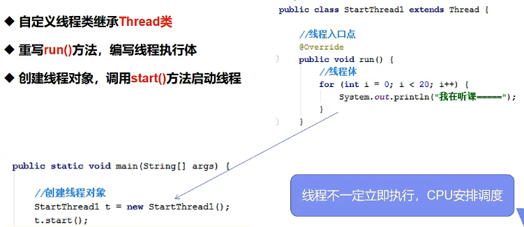**

实例

```java
package com.cxx.thread;

public class TestThread01 extends Thread{
    public static void main(String[] args) {
        // 主线程main
        // 创建一个线程对象
        TestThread01 thread01 = new TestThread01();
        // 调用start()方法开启线程,交替执行
        thread01.start();
        // 调用run()方法开启，先后执行
        // thread01.run();
        for (int i = 0; i < 20; i++) {
            System.out.println("我在学代码" + i);
        }
    }
    @Override
    public void run() {
        for (int i = 0; i < 10; i++) {
            System.out.println("我在看代码"+i);
        }
    }
}
```

**解释图**

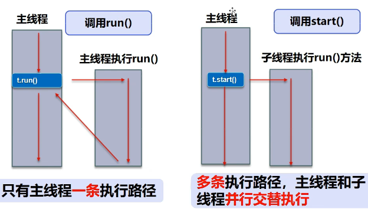

注意：线程开启不一定立即执行，受CPU调动而执行

**练习:多线程下载图片**

```java
package com.cxx.thread;

import org.apache.commons.io.FileUtils;

import java.io.File;
import java.io.IOException;
import java.net.URL;

// 练习，多线程下载图片
public class TestThread02 extends Thread{
    // 地址和文件名
    private String url;
    private String name;

    public TestThread02(String  url, String name){
        this.url= url;
        this.name = name;
    }
    @Override
    public void run() {
        WebDownLoader webDownLoader =new WebDownLoader();
        webDownLoader.downLoader(url,name);
        System.out.println("下载文件名为:"+name);
    }

    public static void main(String[] args) {
        TestThread02 t1 = new TestThread02("","");
        TestThread02 t2 = new TestThread02("","");
        TestThread02 t3 = new TestThread02("","");

        t1.start();
        t2.start();
        t3.start();
    }
}
// 下载器
class WebDownLoader{
    // 下载方法
    public void downLoader(String url,String name){
        try {
            FileUtils.copyURLToFile(new URL(url),new File(name));
        } catch (IOException e) {
            e.printStackTrace();
            System.out.println("IO异常，downloader方法出现问题");
        }
    }
}
```

#### Runnable

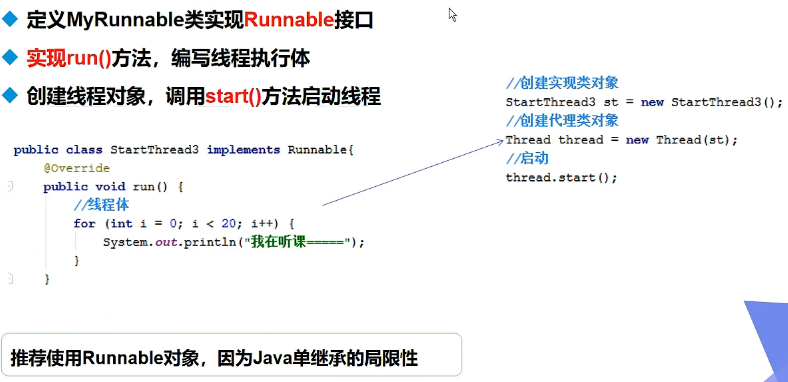

**例子**

```java
package com.cxx.thread;
// 创建线程方式2:实现Runnable接口，重写run方法，执行线程需要有runnable接口实现类，调用start方法
public class TestThread03 implements Runnable{
    public void run(){
        for (int i = 0; i < 20; i++) {
            System.out.println("我在看代码" + i);
        }
    }

    public static void main(String[] args) {
        // 创建runnable接口的实现类对象
        TestThread03 testThread03 = new TestThread03();

        // Runnalbe接口没有start方法，而Thread实现了
        // 所以创建线程对象，通过线程对象来开启线程，代理
        new Thread(testThread03).start();

        for (int i = 0; i < 20; i++) {
            System.out.println("我在学代码" + i);
        }
    }
}

```

特别注意：Runnalbe接口没有start方法，需通过Thread代理

#### **小结**

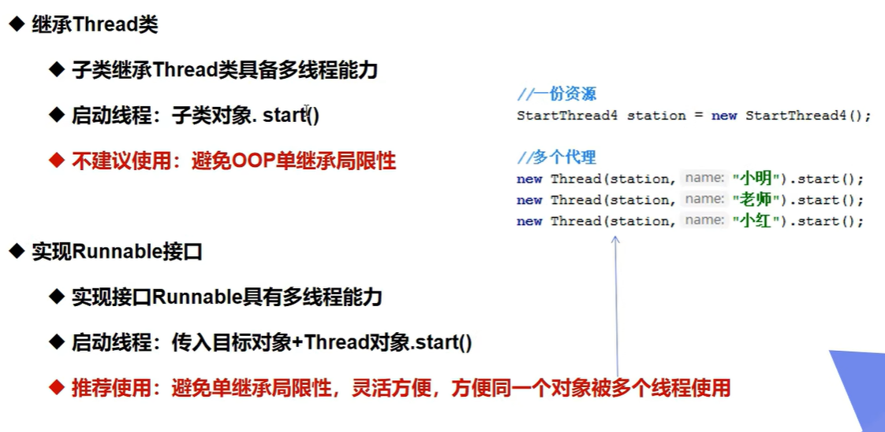

##### 多线程存在的问题

案例一：买票

```java
package com.cxx.net;


// 多线程同时操作同一对象
// 买火车票
// 问题；
// 1.在无延时情况下，会出现拿票顺序不是递减的 2.采用延时后，出现拿同一张票和第0和第-1张票


public class TestThread04 implements Runnable{

    public static void main(String[] args) {
        TestThread04 ticket = new TestThread04();
        new Thread(ticket,"小明").start();
        new Thread(ticket,"小李").start();
        new Thread(ticket,"黄牛").start();

    }
    // 票数
    private int ticketNums = 10;

    @Override
    public void run() {
        while (true){
            if(ticketNums <= 0){
                break;
            }
            // 模拟延时
            try {
                Thread.sleep(100);
            } catch (InterruptedException e) {
                e.printStackTrace();
            }
            System.out.println(Thread.currentThread().getName()+"-->拿到第"+ticketNums--+"票");
        }
    }
}

```

运行结果

```bash
小李-->拿到第9票
小明-->拿到第10票
黄牛-->拿到第8票
小明-->拿到第7票
小李-->拿到第7票
黄牛-->拿到第6票
小明-->拿到第5票
小李-->拿到第4票
黄牛-->拿到第3票
小明-->拿到第2票
小李-->拿到第2票
黄牛-->拿到第1票
小明-->拿到第0票
小李-->拿到第-1票
```

案例二：龟兔赛跑

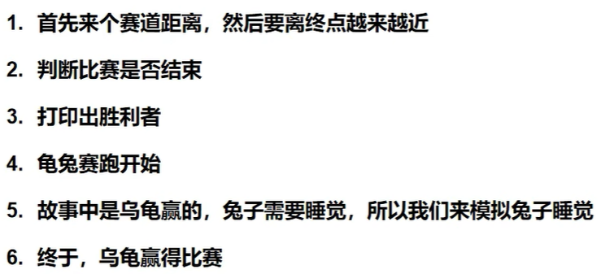

```java
package com.cxx.net;

public class Race implements Runnable{
    private static String winner;
    @Override
    public void run() {
        for (int i = 1; i <= 100; i++) {
            // 设置兔子睡觉
            if(Thread.currentThread().getName().equals("兔子") && i%50==0){
                try {
                    Thread.sleep(5);
                } catch (InterruptedException e) {
                    e.printStackTrace();
                }
            }
            // 判断比赛还在进行
            boolean flag = gameOver(i);
            if(flag){
                break;
            }
            System.out.println(Thread.currentThread().getName() + "-->跑了" + i + "步");
        }

    }

    private boolean gameOver(int steps){
        // 判断是否有胜利者
        if(winner!=null){
            return true;
        }else if(steps>=100){
            winner = Thread.currentThread().getName();
            System.out.println("winner is " + winner);
            return true;
        }
        return false;
    }

    public static void main(String[] args) {
        Race race = new Race();
        new Thread(race,"兔子").start();
        new Thread(race,"乌龟").start();
    }
}
```

#### 实现Callable接口

特点

 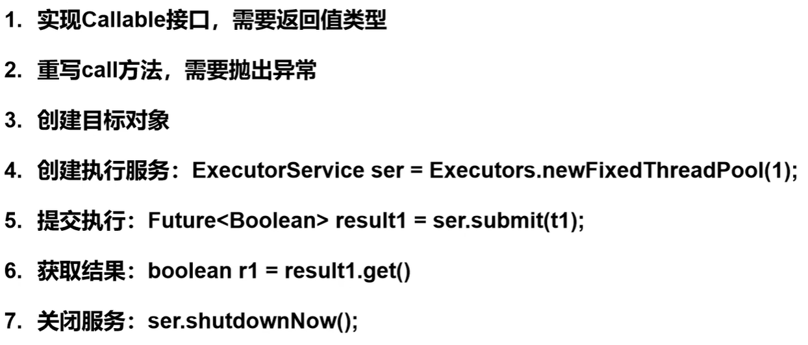

下载图片案例：

```java
package com.cxx.net;
import org.apache.commons.io.FileUtils;
import java.io.File;
import java.io.IOException;
import java.net.URL;
import java.util.concurrent.*;

import java.util.concurrent.*;
/*
Callable的好处：
1.可以定义返回值
2.可以抛出异常
缺点：
写法复杂
*/
public class TestCallable01 implements Callable<Boolean> {
    // 地址和文件名
    private String url;
    private String name;

    public TestCallable01(String  url, String name){
        this.url= url;
        this.name = name;
    }
    @Override
    public Boolean call(){
        WebDownLoader webDownLoader =new WebDownLoader();
        webDownLoader.downLoader(url,name);
        System.out.println("下载文件名为:"+name);
        return true;
    }

    public static void main(String[] args) throws ExecutionException, InterruptedException {
        TestCallable01 t1 = new TestCallable01("","");
        TestCallable01 t2 = new TestCallable01("","");
        TestCallable01 t3 = new TestCallable01("","");

        // 创建执行服务
        ExecutorService service = Executors.newFixedThreadPool(3);
        // 提交执行
        Future<Boolean> r1 = service.submit(t1);
        Future<Boolean> r2 = service.submit(t2);
        Future<Boolean> r3 = service.submit(t3);
        // 获取结果
        Boolean rs1 = r1.get();
        Boolean rs2 = r2.get();
        Boolean rs3 = r3.get();
        // 关闭服务
        service.shutdownNow();

    }
}
// 下载器
class WebDownLoader{
    // 下载方法
    public void downLoader(String url,String name){
        try {
            FileUtils.copyURLToFile(new URL(url),new File(name));
        } catch (IOException e) {
            e.printStackTrace();
            System.out.println("IO异常，downloader方法出现问题");
        }
    }
}

```

#### Lamda表达式

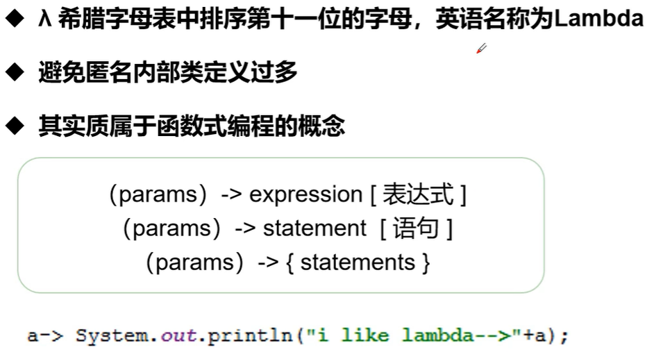

**函数式接口（Functional Interface）**

定义：

- 任何接口，如果只包含唯一一个抽象方法，那么他就是一个函数式接口

  ```java
  public interface Runnable{
  	public abstract void run();
  }
  ```

- 对于函数式接口，我们可以通过lamda表达式来创建该接口的对象

注意以下概念的区别：

1. 一般类
2. 静态内部类
3. 局部内部类
4. 匿名内部类
5. lambda表达式

**lambda表示简化**

```java
Test test = (int a)->{
    test.sout
};
// 1.简化参数
test = (a)->{
    test.sout
};
// 2.简化括号，前提单参数
test = a->{
    test.sout
};
// 3.简化花括号,前提花括号内只有单行代码
test = a->test.sout;

```

### 静态代理

案例：结婚

```java
package com.cxx.net;
// 静态代理模式总结：
// 真实对象和代理对象都实现同一接口
// 代理对象代理真实对象
// 好处：1.代理对象可以实现真实对象需要的功能 2.真实对象不受代理影响

public class StaticProxy {
    public static void main(String[] args) {
        person target = new person();
        weddingCompany weddingCompany = new weddingCompany(target);
        weddingCompany.HappyMarry();
        /* 类比Thread与Runnable,下面使用lambda表达式方法 
        new Thread(()->System.out.println("sth")).start;
        new wedddingCompany(new persion()).HappyMarry();
        */
    }
}

interface Marry{
    void HappyMarry();
}

class person implements Marry{
    @Override
    public void HappyMarry(){
        System.out.println("新婚快乐！");
    }
}

class  weddingCompany implements Marry{
    // 设置代理对象
    private Marry target;

    public weddingCompany(Marry target) {
        this.target =target;
    }

    @Override
    public void HappyMarry() {
        before();
        this.target.HappyMarry();
        after();
    }

    private void after() {
        System.out.println("蜜月旅行");
    }

    private void before() {
        System.out.println("婚前准备");
    }
}
```

## 线程状态

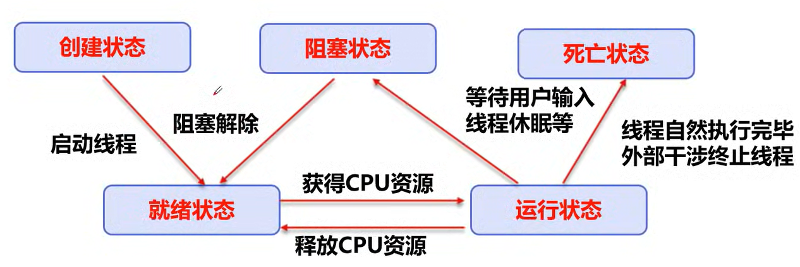

### 线程方法

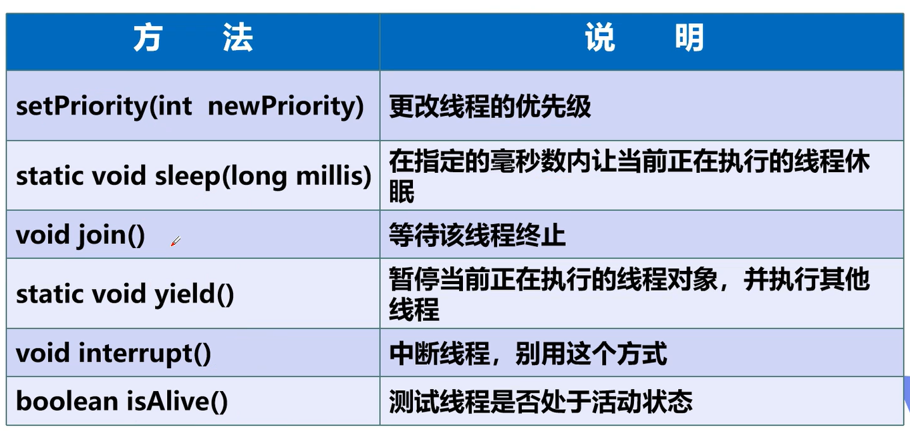

#### 停止线程

JDK中的stop()、destroy()方法均已弃用，推荐线程自行停止，即使用标志位来进行终止。当flag为false，则终止线程运行。

```java
package com.cxx.net;
/*
    测试线程停止
    1.建议正常停止-->利用次数，不建议死循环
    2.建议使用标志位
    3.不要使用弃用的stop和destroy
 */
public class TestStop implements Runnable {
    // 设置标志位
    private boolean flag = true;
    @Override
    public void run() {
        int i = 0;
        while(flag){
            System.out.println("run Thread" + i++);
        }
    }
    // 设置停止线程的公开方法，转换标志位
    public void stop(){
        this.flag = false;
    }

    public static void main(String[] args) {
        TestStop stop = new TestStop();
        Thread thread = new Thread(stop);
        thread.start();
        System.out.println(thread.getState().toString());

        for (int i = 0; i < 100; i++) {
            System.out.println("main" + i);
            if (i==50){
                stop.stop();
                System.out.println("Thread stop");
                System.out.println(thread.getState().toString());
            }
        }
    }
}

```

#### 线程休眠

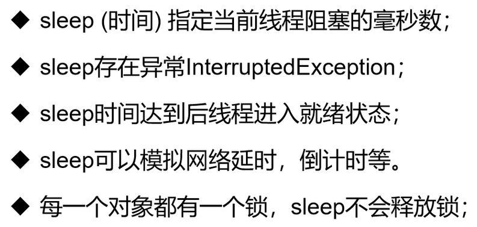

```java
package com.cxx.net;

import java.text.SimpleDateFormat;
import java.util.Date;

public class TestSleep implements Runnable{
    public static void main(String[] args) throws InterruptedException {
        tenDown();
        // 实现实时时间打印
        while (true){
            Date startTime = new Date(System.currentTimeMillis());
            Thread.sleep(1000);
            System.out.println(new SimpleDateFormat("HH:mm:ss").format(startTime));
            startTime = new Date(System.currentTimeMillis());
        }
    }


    @Override
    public void run() {
    }
    // 模拟倒计时
    public static void tenDown() throws InterruptedException {
        int num =100;
        while (true){
            Thread.sleep(1000);
            System.out.println(num--);
            if(num<=0){
                break;
            }
        }
    }
}
```

#### 线程礼让

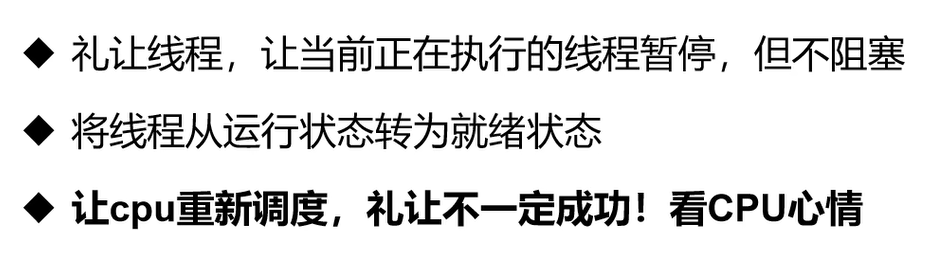

案例：A、B线程

```java
package com.cxx.net;

public class TestYield {
    public static void main(String[] args) {
        MyYield myYield = new MyYield();
        new Thread(myYield,"a").start();
        new Thread(myYield,"b").start();

    }
}

class MyYield implements Runnable{
    @Override
    public void run() {
        System.out.println(Thread.currentThread().getName() + " Thread start");
        Thread.yield();
        System.out.println(Thread.currentThread().getName() + " Thread stop");
    }
}
// 注意礼让不一定成功，所以结果不一定是abba
```

礼让不成功结果如图：

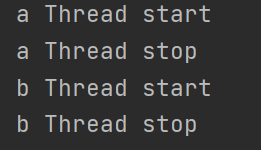

#### 线程强制执行

- jion合并线程，待此线程执行完成后，在执行其他线程（处于线程阻塞）
- 类似插队

```java
package com.cxx.net;
 // 测试join方法
public class TestJoin implements Runnable{
     @Override
     public void run() {
         for (int i = 0; i < 200; i++) {
             System.out.println("插队的来了" + i);
         }
     }

     public static void main(String[] args) throws InterruptedException {
         TestJoin testJoin = new TestJoin();
         Thread thread = new Thread(testJoin);
         thread.start();
         for (int i = 0; i < 500; i++) {
             if(i==100){
                 thread.join();
             }
             System.out.println("main"+i);
         }
     }
 }
// 解释在join前，两线程是同时在进行。但join后是等插队的跑完再执行
```

### 观测线程状态

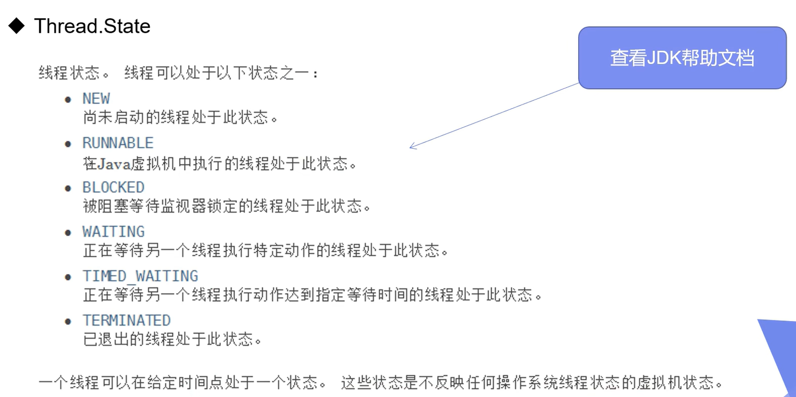

案例：监测

```java
package com.cxx.net;


public class ThreadState {
    public static void main(String[] args){
        Thread thread = new Thread(new Runnable() {
            @Override
            public void run() {
                for (int i = 0; i < 5; i++) {
                    try {
                        Thread.sleep(500);
                    } catch (InterruptedException e) {
                        e.printStackTrace();
                    }
                }
                System.out.println("结束前flag");
            }
        });

        // 观测状态
        System.out.println(thread.getState().toString());

        // 启动后在观测
        thread.start();
        System.out.println(thread.getState().toString());

        //
        while(thread.getState()!= Thread.State.TERMINATED){
            try {
                Thread.sleep(100);
            } catch (InterruptedException e) {
                e.printStackTrace();
            }
            System.out.println(thread.getState().toString());
        }
    }
}
```

## 线程优先级

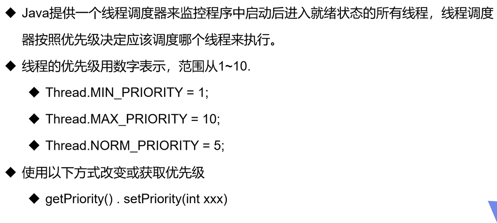

```java
package com.cxx.net;

public class TestPriority implements Runnable{
    @Override
    public void run() {
        System.out.println(Thread.currentThread().getName() + "-->" + Thread.currentThread().getPriority());
    }

    public static void main(String[] args) {
        System.out.println(Thread.currentThread().getName() + "-->" + Thread.currentThread().getPriority());

        TestPriority testPriority = new TestPriority();
        Thread t1 = new Thread(testPriority);
        Thread t2 = new Thread(testPriority);
        Thread t3 = new Thread(testPriority);
        Thread t4 = new Thread(testPriority);
        Thread t5 = new Thread(testPriority);
        Thread t6 = new Thread(testPriority);
        // 设置优先级，在启动
        t1.start();
        t2.setPriority(1);
        t2.start();
        t3.setPriority(4);
        t3.start();
        t4.setPriority(6);
        t4.start();
        t5.setPriority(10);
        t5.start();
        // t6.setPriority(11);
        // t6.start();
    }
}
// 注意优先级低并不意味不会被调用，只是概率会低于优先级高的
```


## 附录

快捷键

ctrl+d 复制上一句话